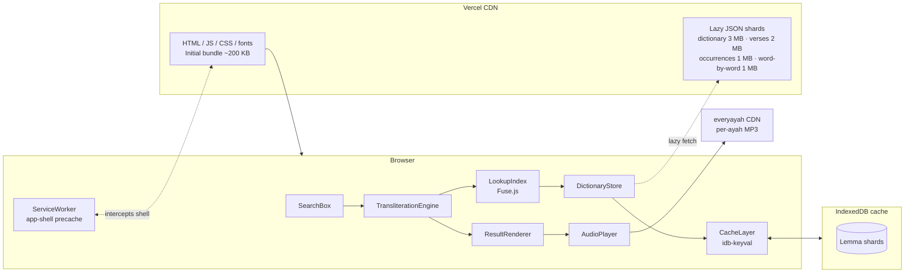
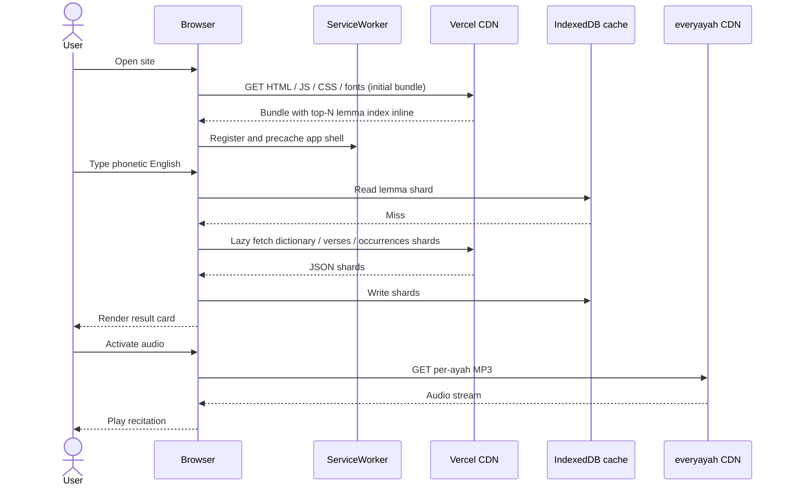
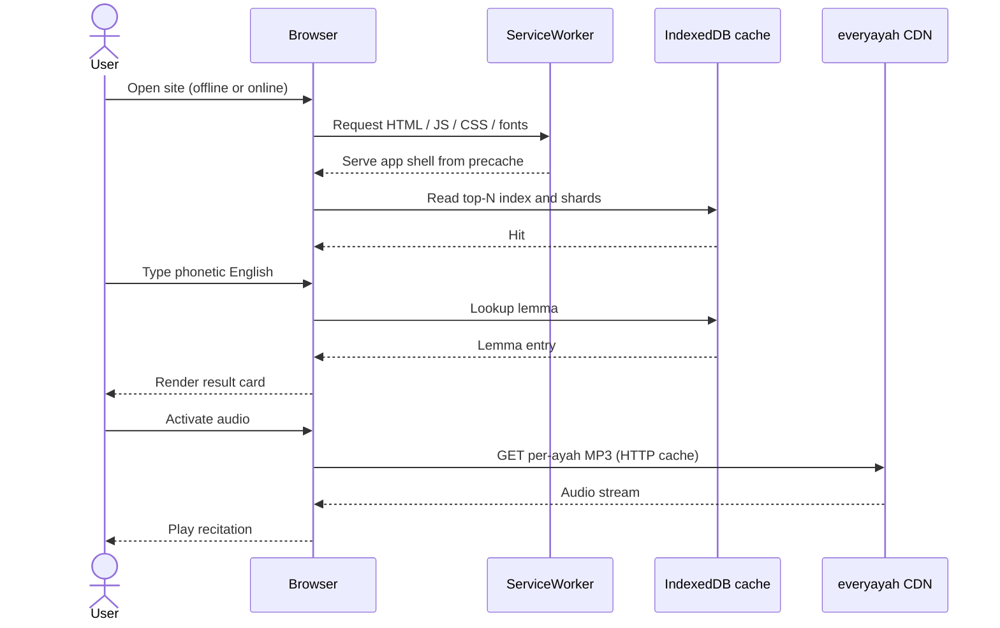

# Architecture

## Overview

Arabic Transliteration is a pure static site. All application logic, including the
transliteration engine, lemma lookup, fuzzy search, and result card rendering, executes in the
browser. The site is delivered as pre-built HTML, JavaScript, CSS, and JSON shards from a content
delivery network. There is no backend owned by this project, no database, and no user accounts.
Audio recitation is the only runtime dependency on a third-party origin.

## High-level diagram

## Components

- SearchBox: input control that captures phonetic English or Arabic script and dispatches queries.
- TransliterationEngine: rule-based normalizer that turns phonetic English into candidate Arabic
  forms suitable for lookup.
- LookupIndex: in-memory Fuse.js index over phonetic keys, lemma surface forms, and roots.
- DictionaryStore: facade over the bundled top-N lemma index and the lazy-loaded full dictionary
  shards.
- CacheLayer: thin wrapper over idb-keyval that persists lemma shards in the IndexedDB cache.
- ResultRenderer: renders the result card with Uthmani script, transliteration, meaning, root
  letters, and occurrences.
- AudioPlayer: requests per-ayah audio from everyayah.com on user activation.
- ThemeProvider: manages light and dark mode and Arabic font size, persisting choices in
  localStorage.
- Service Worker (app-shell precache only): precaches the application shell — HTML, JS, CSS, and
  self-hosted fonts — so warm loads work without a network. The service worker does not cache the
  lazy JSON shards; those continue to live in the IndexedDB cache.

## Module boundaries

The future repository layout maps responsibilities to directories without prescribing
implementation:

- `/src/app`: Next.js App Router routes, including the home page, lemma deep-link routes, and the
  credits page.
- `/src/components/ui`: shadcn/ui primitives.
- `/src/components/search`: SearchBox and search result list.
- `/src/components/word`: result card, root letter display, occurrences list, audio controls.
- `/src/components/layout`: header, footer, theme and font-size controls.
- `/src/lib/transliterator`: rule-based engine and candidate generation.
- `/src/lib/dictionary`: dictionary store, lazy shard loaders, and LookupIndex assembly.
- `/src/lib/storage`: IndexedDB cache wrapper around idb-keyval.
- `/src/lib/utils`: shared helpers, including sura:ayah formatting.
- `/src/hooks`: React hooks for search state, theme, and cache lifecycle.
- `/src/types`: shared TypeScript types, including the LemmaEntry shape.
- `/public/data`: pre-built JSON shards emitted by the build pipeline.
- `/public/fonts`: self-hosted Amiri, Scheherazade New, and Inter font files.
- `/scripts`: build-time tooling, including `build-dictionary.ts`.
- `/data/sources`: raw, committed source datasets from Tanzil, the Quranic Arabic Corpus, and
  Quran.com.
- `/tests/unit`: Vitest unit tests.
- `/tests/e2e`: Playwright end-to-end tests.

## Runtime data flow

### Cold load (first visit)

### Warm load (cached)

## Bundle and storage budget

This table is the canonical source for bundle and storage sizes across the project. Other
documents reference it instead of restating these numbers.

| Asset                     | Size (gzipped) | Delivery                                    |
| ------------------------- | -------------- | ------------------------------------------- |
| Initial JS + CSS          | ≤ 200 KB       | Static, CDN-cached, immutable hashed assets |
| Top-N lemma index inline  | ≤ 50 KB        | Inlined into the initial bundle             |
| Full dictionary           | ≤ 3 MB         | Lazy-loaded JSON shard on first real use    |
| Verses (Uthmani text)     | ≤ 2 MB         | Lazy-loaded JSON shard on first real use    |
| Word-occurrences          | ≤ 1 MB         | Lazy-loaded JSON shard on first real use    |
| Word-by-word translations | ≤ 1 MB         | Lazy-loaded JSON shard on first real use    |
| Total cached ceiling      | ≤ 7 MB         | IndexedDB cache via idb-keyval              |

## Why no backend

A static site is the smallest possible attack surface, has no per-request server cost, and degrades
gracefully on slow networks. Removing accounts removes the largest source of personal data and the
largest compliance burden. See [ADR-0002](adr/0002-no-backend-no-accounts-v1.md). The minimal
app-shell service worker lives at `/public/sw.js` and is registered from the root layout; it runs
entirely client-side and does not introduce a backend dependency.

## Related decisions

- [ADR-0001 Tech stack](adr/0001-tech-stack.md)
- [ADR-0002 No backend, no accounts in v1](adr/0002-no-backend-no-accounts-v1.md)
- [ADR-0003 Rule-based transliteration](adr/0003-rule-based-transliteration.md)
- [ADR-0006 Hybrid build pipeline](adr/0006-hybrid-build-pipeline.md)
