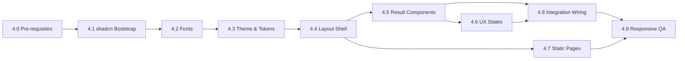

# Phase 4: UI — Design-First Execution Plan

> **Design-First Process.** This is a temporary staging document for Phase 4 UI/UX execution details. Authority and execution source-of-truth for Phase 4 is [phase-4-ui.md](phase-4-ui.md). All implementation is downstream from approved design artifacts. The single visual source of truth is [design.html](../design/design.html). No UI/UX code may be implemented or merged without prior design review and approval.

> **Canonicality Note.** This file is temporary and non-authoritative. [phase-4-ui.md](phase-4-ui.md) is the canonical Phase 4 execution and gating source-of-truth. Nothing in this staging file overrides [phase-4-ui.md](phase-4-ui.md).
> If any statement in this file conflicts with [phase-4-ui.md](phase-4-ui.md), [phase-4-ui.md](phase-4-ui.md) prevails.

> **Step 1 Scope (Truth Alignment).** Step 1 is documentation-only and does not modify runtime, app, test, or config code.


## Overview

Phase 4 delivers the full UI/UX experience for the Arabic Transliteration project, strictly following a design-first process. All visual and interaction work is governed by [design.html](../design/design.html), which is the only normative visual reference. Implementation is strictly downstream from design artifacts. No code is written or merged until the corresponding design is reviewed and approved.

### Gating Criteria

**No implementation may begin until:**

- The relevant section/component/artifact is present in [design.html](../design/design.html).
- The design has been reviewed and approved by the designated reviewer(s).
- The design artifact is referenced in the implementation PR.

**No UI/UX code is merged without design review sign-off.**


## Phase 4 Checklist Board (Steps 2-5)

Step 1 (this update) is complete as docs-only truth alignment. The board below tracks execution work from Step 2 onward while preserving design-first gating.

| Step | Objective | Dependencies | Deliverables | Exit Criteria | Owner / Status | Blockers / Risks | Evidence |
| --- | --- | --- | --- | --- | --- | --- | --- |
| 2 | Lock and approve design artifacts before implementation. | Step 1 complete; [design.html](../design/design.html) and design annotations updated; reviewer availability. | Approved design snapshots for all in-scope Stage 4 components and states; recorded design review sign-off. | Every in-scope component/state has approved design evidence and PRs can reference it. | Owner: `TBD`<br>Status: `Not started` | `TBD` | Design review links: `TBD`<br>Artifact references: `TBD` |
| 3 | Implement Phase 4 UI slices in stage order under approved designs. | Step 2 approved artifacts; Stage sequencing/dependencies in this file. | Landed UI implementation PRs for Stages 4.1-4.8 with linked approved artifacts. | All stage deliverables are implemented with no gate violations and with traceable artifact links. | Owner: `TBD`<br>Status: `Not started` | `TBD` | PR links: `TBD`<br>Stage completion notes: `TBD` |
| 4 | Validate quality, accessibility, responsive behavior, and integration. | Step 3 merged implementation; QA plans from Stages 4.6-4.9. | Test and QA evidence for component behavior, a11y checks, and responsive pass criteria. | QA evidence demonstrates all Stage 4 exit conditions are met or formally waived. | Owner: `TBD`<br>Status: `Not started` | `TBD` | Test run links: `TBD`<br>QA checklist evidence: `TBD` |
| 5 | Prepare final Phase 4 handoff and readiness sign-off. | Step 4 validated evidence; open-risk review complete. | Phase 4 completion summary, remaining risks/blockers log, and handoff decision record. | Explicit go/no-go decision recorded with accountable owners for any carry-over risks. | Owner: `TBD`<br>Status: `Not started` | `TBD` | Handoff notes: `TBD`<br>Decision record: `TBD` |


## Stage Summary (Design-First)

| #   | Stage                   | Key Design Output                                               | Depends on |
| --- | ----------------------- | --------------------------------------------------------------- | ---------- |
| 4.0 | Pre-requisites & Dependencies | Font files confirmed, npm dependencies installed, design.html tablet breakpoint added | — |
| 4.1 | shadcn Bootstrap        | shadcn/ui primitives referenced in design.html                  | —          |
| 4.2 | Fonts                   | Font usage, fallback, and rendering defined in design.html      | 4.1        |
| 4.3 | Theme & Tokens          | Color tokens, dark mode, font-size controls in design.html      | 4.2        |
| 4.4 | Layout Shell            | Header, SearchBox, Footer, layout structure in design.html      | 4.3        |
| 4.5 | Result Components       | WordCard, RootDisplay, AudioPlayer, VerseList in design.html    | 4.4        |
| 4.6 | UX States               | Empty, loading, no-results, error, offline-ready in design.html | 4.5        |
| 4.7 | Static Pages            | About, Credits, Privacy Policy in design.html                   | 4.4        |
| 4.8 | Integration Wiring      | Interaction flows mapped in design.html                         | 4.5, 4.6   |
| 4.9 | Responsive QA           | Responsive/adaptive states, accessibility in design.html        | 4.8, 4.7   |


## Stage Details & Process


### 4.0 — Pre-requisites & Dependencies

**Must be verified complete before Stage 4.1 begins.**

**Font files (confirm all present in `/public/fonts`):**
- Amiri: Regular, Bold, BoldItalic, Italic ✓
- Scheherazade New: Regular, Medium, SemiBold, Bold ✓
- Inter: `Inter-VariableFont_opsz,wght.ttf` and `Inter-Italic-VariableFont_opsz,wght.ttf` ✓

**npm dependencies to add before starting UI work:**

| Package | Scope | Purpose |
| --- | --- | --- |
| `lucide-react` | `dependencies` | Icon library — shadcn/ui companion |
| `@testing-library/react` | `devDependencies` | Component-level unit testing |
| `@testing-library/user-event` | `devDependencies` | Simulates real user interactions in tests |
| `@axe-core/playwright` | `devDependencies` | Accessibility audit wired into Playwright E2E suite |
| `next-pwa` | `devDependencies` | Service Worker / Workbox integration for Next.js |
| `@testing-library/jest-dom` | `devDependencies` | Custom DOM matchers for Vitest component tests (`.toBeInTheDocument()`, etc.) |

**Design artifact:**
- `design.html` must include the 1024px tablet breakpoint and the full Lucide icon inventory before implementation begins.

**shadcn/ui initialization:**
- `components.json` is present at the project root. ✓
- `components/ui/` directory exists (currently empty — shadcn components not yet scaffolded). ✓

---


### 4.1 — shadcn Bootstrap

**Design Output:**
- All shadcn/ui primitives to be used are visually referenced in [design.html](../design/design.html) and listed in the component inventory.

**Process:**
- Designers add/annotate all primitives in design.html.
- Design review/approval is required before any code is written.
- Developers implement only after design artifact is approved and referenced.

**Icon Library Decision:**

| Decision | Value |
| --- | --- |
| Library | `lucide-react` (shadcn/ui companion) |
| Version | `^0.400.0` |
| Custom SVGs | Only where no Lucide equivalent exists |

**Icon inventory:**

| Lucide icon | Usage | Size |
| --- | --- | --- |
| `Search` | SearchBox input adornment | 20 |
| `Sun` | ThemeToggle — light mode | 20 |
| `Moon` | ThemeToggle — dark mode | 20 |
| `Play` | AudioPlayer — play | 20 |
| `Pause` | AudioPlayer — pause | 20 |
| `Volume2` | AudioPlayer — audio playing indicator | 16 |
| `VolumeX` | AudioPlayer — audio error state | 16 |
| `ChevronDown` | VerseList — expand occurrences | 16 |
| `ChevronUp` | VerseList — collapse occurrences | 16 |
| `X` | Dismiss error / notification | 16 |
| `CircleAlert` | Error state indicator | 20 |
| `Loader2` | Loading state (CSS spin animation) | 20 |
| `WifiOff` | Offline-ready badge | 16 |
| `ExternalLink` | Link to external source (everyayah, corpus) | 16 |

**Icon conventions:**
- Icon-only interactive elements: `aria-label` on the `<button>`, `aria-hidden={true}` on the `<svg>`.
- Decorative icons: `aria-hidden={true}`.
- Icons are not auto-mirrored for RTL — only swap intentional directional glyphs (e.g., ChevronLeft/Right in pagination).
- FontSizeControl (S/M/L/XL) uses text labels, not icons.
- Always use **named imports**: `import { Search } from 'lucide-react'`. Never use a default or namespace import (`import * as Icons from 'lucide-react'`) — this would bundle the entire icon set (~500 KB+) and violate the ≤ 200 KB initial JS + CSS budget.

---


### 4.2 — Fonts

**Design Output:**
- Font usage, fallback, and rendering details are visually specified in [design.html](../design/design.html).
- Font pairings and fallback strategies are annotated for both Arabic and English text.

**Process:**
- Designers update design.html to show all font usage and annotate requirements.
- Design review/approval is required before implementation.

**Inter variable font strategy:**
Use `Inter-VariableFont_opsz,wght.ttf` — a single variable font file covering all weights (100–900) and optical sizes. Do not load individual static weight files. Reference it via `next/font/local`.

**`next/font` decision:**
Use `next/font/local` (Next.js built-in) for all three font families:
- Automatic `font-display: swap` for Inter (English UI copy).
- `font-display: optional` for Arabic display (Amiri / Scheherazade New) to avoid FOUT on the large Arabic headline.
- Built-in `<link rel="preload">` — no manual preload tags needed.
- Zero layout shift — fonts are loaded before the page is shown.
- No CDN requests — all fonts are self-hosted.

**Arabic font subsetting:**
- Tool: `pyftsubset` (part of the `fonttools` Python package, installed separately as a one-time build step).
- Subset both Amiri and Scheherazade New against the full Quranic glyph inventory from the build pipeline.
- Retain all diacritic glyphs; do not subset diacritics.
- Keep the original `.ttf` files as backups in `public/fonts/`. Ship only `.woff2` subsets to the browser.
- Output path: `public/fonts/<Family>/<Family>-quran-subset.woff2`.
- Run subsetting once before Stage 4.2 ships; re-run only if the glyph inventory changes.

---


### 4.3 — Theme & Tokens

**Design Output:**
- All color tokens, dark mode, and font-size controls are visually specified and annotated in [design.html](../design/design.html).

**Process:**
- Designers define and annotate all tokens and controls in design.html.
- Design review/approval is required before implementation.

**ThemeProvider:**
- Library: `next-themes`
- Wraps `app/layout.tsx`: `<ThemeProvider attribute="class" defaultTheme="system" enableSystem>`
- Dark mode = `.dark` class on `<html>`, toggled by next-themes
- localStorage key: `"theme"` (next-themes default; stored values: `"light"` | `"dark"` | `"system"`)
- Default theme: `"system"` — respects `prefers-color-scheme` on first visit
- FOUC prevention: next-themes injects a blocking script before React hydration; add `suppressHydrationWarning` to `<html>`
- System preference sync: when stored as `"system"`, theme tracks `prefers-color-scheme` changes in real time

**ThemeToggle:**
- Placement: header, top-right corner, inside the nav row
- Size: 40×40px icon button, `border-radius: 0.5rem`, transparent background, `1.5px solid border`
- Icon convention: shows the **target** mode (not current mode)
  - Currently **light** → show `Moon` icon, `aria-label="Switch to dark mode"`
  - Currently **dark** → show `Sun` icon, `aria-label="Switch to light mode"`
- Transition: `var(--transition-base)` on hover/focus
- ARIA: `aria-label` on `<button>`; `aria-hidden={true}` on icon SVG

**localStorage keys:**
- Theme preference: `"theme"` (next-themes default)
- Arabic font size: `"arabic-font-size"`

**Motion / Transitions (CSS-only — no JS animation library):**
All transitions and animations use CSS only. Framer Motion and similar JS animation libraries are excluded to preserve the ≤ 200 KB initial JS + CSS budget.

Motion tokens to define in the Tailwind theme / CSS variables:

| Token | Value | Usage |
| --- | --- | --- |
| `--transition-base` | `150ms ease-in-out` | Button hover/focus, input focus ring |
| `--transition-panel` | `250ms ease-in-out` | VerseList collapsible open/close |
| `--transition-fade` | `200ms ease-out` | UX state transitions (empty → loading → result) |

All transitions must respect `prefers-reduced-motion: reduce` — set `transition: none` inside that media query.

---


### 4.4 — Layout Shell

**Design Output:**
- The full layout structure, including Header, SearchBox, Footer, and all semantic/ARIA requirements, is visually specified in [design.html](../design/design.html).

**Process:**
- Designers update design.html with annotated layout structure and accessibility notes.
- Design review/approval is required before implementation.

**Favicon:**
Provide the following files in `public/`:
- `favicon.ico` — multi-size (16×16, 32×32).
- `favicon.svg` — vector version using `--color-primary` (#2F6F5C light / #72AB96 dark).
- `apple-touch-icon.png` — 180×180 px.
Add `<link rel="icon">` and `<link rel="apple-touch-icon">` in `app/layout.tsx`.

**Error boundary:**
Implement `app/error.tsx` (Next.js App Router error boundary). Displays a minimal "Something went wrong" message with a "Try again" button that calls `reset()`. Style matches the error UX state in Stage 4.6.

**Keyboard shortcut (desktop only):**
Pressing `/` anywhere on the page focuses the SearchBox — unless focus is already inside a text input or textarea. Implement as a `useSearchShortcut` hook. Does not apply on mobile (touch devices).

**Focus management:**
- When search results appear: keyboard focus stays in the SearchBox. Results are announced via `role="status"` / `aria-live="polite"` — screen readers read the result count without moving focus.
- When the result card renders: the WordCard is scrolled into view; the first focusable element (AudioPlayer play button) is reachable via Tab.
- When VerseList expands: focus moves to the first verse item in the list.

**Tablet breakpoint:**
The 1024px breakpoint has been added to `design.html`. Use Tailwind's `lg:` prefix (1024px) for tablet-specific layout adjustments. Tailwind's default breakpoints (`sm`: 640px, `md`: 768px, `lg`: 1024px, `xl`: 1280px) are sufficient — no custom breakpoint values needed.

**Security headers (`next.config.ts`):**
Add HTTP response headers for all routes:
- `X-Content-Type-Options: nosniff`
- `X-Frame-Options: DENY`
- `Referrer-Policy: strict-origin-when-cross-origin`
- `Permissions-Policy: camera=(), microphone=(), geolocation=()`
- Content-Security-Policy: **⚠ PENDING APPROVAL** — `media-src` directive for `everyayah.com` must be confirmed before CSP is enforced. Do not block merge on this item; track as an open action.

---


### 4.5 — Result Components

**Design Output:**
- All result components (WordCard, RootDisplay, AudioPlayer, VerseList) are visually specified and annotated in [design.html](../design/design.html), referencing [../spec.md](../spec.md#result-card-contract) for structure.

**Process:**
- Designers update design.html with all result component states and accessibility annotations.
- Design review/approval is required before implementation.

---


### 4.6 — UX States

**Design Output:**
- All canonical UX states (empty, loading, no-results, error, offline-ready) are visually specified and annotated in [design.html](../design/design.html), referencing [../ux-design.md](../ux-design.md#states).

**Process:**
- Designers update design.html with all UX states and accessibility notes.
- Design review/approval is required before implementation.

**Loading state visual form: shimmer skeleton (not a spinner):**
The loading state renders a skeleton that matches the approximate shape and layout of the WordCard:
- A wide rectangular block (Arabic headline).
- Two narrower rectangular rows (transliteration + English meaning).
- A row of pill-shaped blocks (root letters).
- A rectangular button-shaped block (AudioPlayer row).

The shimmer animation is a CSS `@keyframes` gradient sweep (left-to-right) over `--color-surface` using a lighter overlay.
The skeleton element has `role="status"` and `aria-label="Loading result…"`.
Under `prefers-reduced-motion: reduce`: replace the animation with static grey blocks (no sweep).

---


### 4.7 — Static Pages

**Design Output:**
- All static pages (About, Credits, Privacy Policy) are visually specified and annotated in [design.html](../design/design.html).

**Process:**
- Designers update design.html with all static page layouts and content structure.
- Design review/approval is required before implementation.

**Content outlines (author and confirm before implementation):**

*About page (`/about`):*
- One-sentence project purpose.
- Who it is for: three learner profiles (new convert, second-generation learner, student/researcher).
- How it works: type phonetic English → Uthmani script + scholarly transliteration + English meaning + root letters + verse occurrences + audio.
- Coverage: approximately 3,500 Quranic lemmas.
- Privacy note: no accounts, no tracking, works offline after first visit.
- Open-source: MIT license (code), data sources under their respective licenses (link to Credits).

*Credits page (`/credits`):*

| Source | Attribution | URL |
| --- | --- | --- |
| Tanzil Quran Text (Uthmani, v1.1) | Tanzil Project — CC-BY-ND 4.0 | https://tanzil.net |
| Quranic Arabic Corpus (v0.4) | Kais Dukes © 2011, custom license | https://corpus.quran.com |
| Word-by-Word Translation | Tarteel / Qul — free use, permission granted 6 May 2026 | https://qul.tarteel.ai |
| Yusuf Ali Translation | Tarteel / Qul — free use, permission granted 6 May 2026 | https://qul.tarteel.ai |
| Audio | everyayah.com — Saad Al-Ghamdi (40 kbps) *(pending formal permission)* | https://everyayah.com |
| Amiri font | Khaled Hosny — OFL | |
| Scheherazade New font | SIL International — OFL | |
| Inter font | Rasmus Andersson — OFL | |
| Fuse.js | MIT | |
| Next.js, React, Tailwind CSS, shadcn/ui, Lucide React, idb-keyval | respective open-source licenses | |

*Privacy Policy page (`/privacy`):*
- **Stored locally on your device:** theme preference and Arabic font size (localStorage); lemma lookup cache (IndexedDB). Never transmitted anywhere.
- **Not collected:** no analytics cookies, no IP logging, no advertising data, no cross-site tracking.
- **Third-party connections:** everyayah.com CDN is contacted only when you press Play. No other third-party requests. All fonts, scripts, and data are self-hosted.
- **Data deletion:** clear browser site data to remove all stored data.
- **Effective date** placeholder — to be confirmed before launch.

---


### 4.8 — Integration Wiring

**Design Output:**
- All interaction flows and state transitions are mapped and annotated in [design.html](../design/design.html).

**Process:**
- Designers update design.html with all interaction flows and state diagrams.
- Design review/approval is required before implementation.

**Service Worker (app-shell precache):**
- Scope: precache `/_next/static/**`, `/fonts/**`, `/data/manifest.json`, and the root HTML shell.
- Tool: Workbox via `next-pwa` package, or hand-rolled `workbox-webpack-plugin` with `injectManifest` mode.
- Cache strategy: Cache-first for all app-shell assets (immutable hashed JS/CSS and self-hosted fonts). The Service Worker does NOT cache `/data/*.json` shards — those continue to be fetched lazily by the DictionaryStore and cached in IndexedDB via idb-keyval, as defined in architecture.md.
- Register the Service Worker in production builds only (`process.env.NODE_ENV === 'production'`).
- The Service Worker does not cache or intercept audio streaming from everyayah.com (third-party origin).
- Test: load the site, disable network in DevTools, reload — the app shell must load from cache.

**PWA manifest (`public/manifest.json`):**
```json
{
  "name": "Arabic Transliteration",
  "short_name": "ArabicTranslit",
  "description": "Phonetic Arabic search for Quranic vocabulary.",
  "start_url": "/",
  "display": "standalone",
  "background_color": "#F7F3EA",
  "theme_color": "#2F6F5C",
  "icons": [
    { "src": "/icons/icon-192.png", "sizes": "192x192", "type": "image/png" },
    { "src": "/icons/icon-512.png", "sizes": "512x512", "type": "image/png" }
  ]
}
```
Add `<link rel="manifest" href="/manifest.json">` in `app/layout.tsx`.
Icon files needed: `public/icons/icon-192.png` and `public/icons/icon-512.png`.

**SEO metadata (add to `app/layout.tsx` metadata export):**
- `title`: "Arabic Transliteration — Quranic Phonetic Search"
- `description`: "Type phonetic English to find any Quranic word in Uthmani script, with meaning, root letters, verse occurrences, and audio pronunciation."
- OpenGraph: `og:title`, `og:description`, `og:type: "website"`, `og:url`, `og:image` (1200×630 static social card).
- Twitter: `twitter:card: "summary_large_image"`, `twitter:title`, `twitter:description`, `twitter:image`.
- `robots.txt` (`public/robots.txt`): Allow all crawlers; include `Sitemap:` directive pointing to `/sitemap.xml`.
- `sitemap.xml` (`public/sitemap.xml` or generated via `next-sitemap`): List `/`, `/about`, `/credits`, `/privacy`.

**⚠ Pending: CORS/CSP for everyayah.com audio**
The `media-src` CSP directive for everyayah.com is pending approval. Do not merge a restrictive CSP until this is confirmed. Track as an open action item.

---


### 4.9 — Responsive QA

**Design Output:**
- Responsive/adaptive states, accessibility requirements, and QA checklists are visually specified and annotated in [design.html](../design/design.html).

**Process:**
- Designers update design.html with all responsive/adaptive states and accessibility notes.
- Design review/approval is required before implementation.

**Component tests (Vitest + Testing Library):**
Every UI component built in Stages 4.4–4.7 must have at minimum:
- A render smoke test (component renders without throwing).
- A behavior test for each interactive element: search input change, ThemeToggle, FontSizeControl, AudioPlayer play/pause, VerseList expand/collapse, error state dismiss.
- Tests use `@testing-library/react` and `@testing-library/user-event`.
- Create `tests/setup.ts` with `import '@testing-library/jest-dom'` and reference it in `vitest.config.mts` via the `setupFiles` option.
- Place component tests under `tests/components/`.

**axe-core accessibility audit:**
- `@axe-core/playwright` is wired into the Playwright E2E suite.
- Run `checkA11y(page)` on every key page (home, about, credits, privacy).
- Zero WCAG AA violations is a CI gate for merge to `main`.

**Tablet breakpoint QA:**
- Add a 1024px viewport profile to the Playwright device list.
- Run the full search → result card flow at 1024px width.
- Verify layout does not break between 768px and 1024px.

**Keyboard shortcut QA:**
- E2E test: press `/` on desktop → SearchBox receives focus → type query → result card appears.
- E2E test: press `/` when focus is already inside a text field → shortcut does not fire, text is typed normally.


## Process for Updating design.html and Syncing with Code

1. **Designers** update [design.html](../design/design.html) with new or revised artifacts, referencing [phase-4-ui.md](phase-4-ui.md) for structure and principles.
2. **Design review/approval** is required for all changes. Reviewers check for:
   - Visual and interaction fidelity
   - Accessibility and responsive requirements
  - Consistency with [phase-4-ui.md](phase-4-ui.md) principles
3. **Developers** may only begin implementation after design approval. All implementation PRs must reference the approved design artifact and include a design review sign-off.
4. **If design.html changes after implementation begins:**
   - Pause implementation
   - Review diffs with both designers and developers
   - Sync code to match the updated design before merging

## Additional Design Deliverables

- **Component Inventory:**
  - A complete, up-to-date inventory of all UI components, with visual references and states, must be maintained in [design.html](../design/design.html).
- **Style Guide:**
  - Color palette, typography, spacing, iconography, and interaction patterns must be documented and visually referenced in [design.html](../design/design.html).
- **Accessibility Checklist:**
  - All accessibility requirements (keyboard navigation, ARIA, color contrast, screen reader support, etc.) must be documented and visually annotated in [design.html](../design/design.html).
- **Contribution Guide:**
  - A clear process for proposing, reviewing, and updating design artifacts must be documented in this file and referenced in [design.html](../design/design.html).

## References

- [design.html](../design/design.html) — Single visual source of truth for all UI/UX work
- [phase-4-ui.md](phase-4-ui.md) — Canonical Phase 4 execution and gating source-of-truth
- [../spec.md](../spec.md) — Functional specification and result card contract
- [../ux-design.md](../ux-design.md) — UX states and visual style
- [../architecture.md](../architecture.md) — Module boundaries and bundle budgets
- [../performance.md](../performance.md) — Core Web Vitals targets and CI budgets
- [../testing-strategy.md](../testing-strategy.md) — Test pyramid and CI gates
- [../adr/0001-tech-stack.md](../adr/0001-tech-stack.md) — Stack choices (Next.js, shadcn/ui, Tailwind)

## Resolved Design Decisions

The following decisions have been confirmed and are binding for all implementation work in Phase 4.

| Decision | Resolution |
| --- | --- |
| Icon library | Lucide React (`lucide-react ^0.400.0`) |
| Motion / animations | CSS-only transitions and animations; no JS animation library |
| Inter font loading | `next/font/local` with variable font (`Inter-VariableFont_opsz,wght.ttf`) |
| Arabic font loading | `next/font/local` with `font-display: optional`; WOFF2 subsets via `pyftsubset` |
| Service Worker | Workbox (via `next-pwa` or `injectManifest`); app-shell precache; register in production only |
| Keyboard shortcut | `/` key focuses SearchBox on desktop; no shortcut on mobile |
| Loading state form | Shimmer skeleton matching WordCard shape (not a spinner) |
| Tablet breakpoint | 1024px (`lg:` in Tailwind); documented in `design.html` |
| SEO/meta | OpenGraph + Twitter cards + `sitemap.xml` + `robots.txt` + basic PWA `manifest.json` — all in Phase 4 |
| Component tests | Vitest + `@testing-library/react` + `@testing-library/user-event` in `tests/components/` |
| Accessibility CI gate | `@axe-core/playwright` — zero WCAG AA violations blocks merge to `main` |
| CORS/CSP for everyayah.com | **Pending approval** — do not enforce CSP `media-src` until confirmed |
| Theme library | `next-themes` |
| Dark mode mechanism | `.dark` class on `<html>`, toggled by `next-themes` ThemeProvider |
| localStorage key (theme) | `"theme"` (next-themes default) |
| Default theme | `"system"` (follows `prefers-color-scheme`) |
| ThemeToggle icon convention | Shows target mode — Moon when in light mode; Sun when in dark mode |
| localStorage key (Arabic font size) | `"arabic-font-size"` |


## Notes for Designers and Developers

- **Designers:**
  - All visual and interaction work must be present and annotated in [design.html](../design/design.html) before implementation begins.
  - Reference [phase-4-ui.md](phase-4-ui.md) for execution structure, principles, and gating alignment.
- **Developers:**
  - Implementation is strictly downstream from approved design artifacts.
  - No UI/UX code is merged without design review sign-off.
  - If design.html changes, implementation must pause and sync to the new design before proceeding.

---

## Dependency Graph




## Risks and Sequencing Notes

| Risk                                                        | Mitigation                                                                             |
| ----------------------------------------------------------- | -------------------------------------------------------------------------------------- |
| Arabic font rendering differences across operating systems  | Self-host with explicit `font-feature-settings`; test Chrome, Firefox, Safari early.   |
| shadcn dark-mode token gaps                                 | Extend the Tailwind theme in Stage 4.3 to cover missing surfaces before building UI.   |
| Mobile keyboard covering the search field                   | Test with real device viewports in 4.9; reserve scroll space below the input.          |
| Font subsetting removes needed glyphs                       | Subset against the full Quranic glyph inventory; keep the un-subsetted file as backup. |
| Integration wiring reveals engine/lookup regressions        | Run the Phase 2–3 test suites before starting 4.8; fix upstream before wiring.         |
| Static page content accuracy (credits, licensing)           | Cross-check against `data/sources/licenses.json` and [../licensing.md](../licensing.md). |
| Service Worker app-shell cache is stale after a Next.js deploy | Use `NEXT_PUBLIC_BUILD_ID` or Workbox revision hashing to invalidate the SW cache on every production deploy |
| PWA manifest icons missing at launch | Create `public/icons/icon-192.png` and `icon-512.png` before Stage 4.8 ships; add to pre-launch checklist |
| everyayah.com CORS/CSP blocks audio in production | Track as open action; do not enforce restrictive CSP until `media-src everyayah.com` is confirmed |
| Lucide React version updates change icon shapes | Pin `lucide-react` to a minor range (`^0.400.0`) and review icon changes in the upgrade changelog before bumping |
| pyftsubset removes needed Quranic glyphs during Arabic font subsetting | Validate subsetted font against full Quranic glyph inventory from the build pipeline before shipping |
| Inter variable font optical sizing causes unexpected weight rendering | Test at `opsz` 14 (body) and 32 (display) sizes; fall back to `Inter_18pt` static files if variable font behaves unexpectedly |


**Sequencing notes:**

- All implementation is downstream from design.html and requires design review/approval.
- Stages 4.5/4.6 and 4.7 are independent once 4.4 is complete and can be worked in parallel, but only after design artifacts are approved.
- Stage 4.8 must wait for both 4.5 and 4.6 because it wires result components to all UX states.
- Stage 4.9 is the only stage that requires a fully assembled application; it runs last.
- Each stage should end with a passing `tsc --noEmit`, `eslint`, and `vitest` run before moving to the next.

## Related documents

- [phase-4-ui.md](phase-4-ui.md) — Phase 4 overview and acceptance criteria
- [../spec.md](../spec.md) — Functional specification and result card contract
- [../ux-design.md](../ux-design.md) — Visual style, component inventory, and UX states
- [../architecture.md](../architecture.md) — Module boundaries and bundle budgets
- [../performance.md](../performance.md) — Core Web Vitals targets and CI budgets
- [../testing-strategy.md](../testing-strategy.md) — Test pyramid and CI gates
- [../adr/0001-tech-stack.md](../adr/0001-tech-stack.md) — Stack choices (Next.js, shadcn/ui, Tailwind)

## Verifier Remediation: Phase Analysis (2026-07-05)

### Step RAG table

| Step | RAG | Canonical acceptance criteria impact | Direct evidence | Rationale |
| --- | --- | --- | --- | --- |
| 2 — Lock and approve design artifacts | Amber | AC1, AC2 are at risk until design approval evidence is complete (`docs/phases/phase-4-ui.md:49-52`). | Design artifact content exists (`docs/design/design.html:104`, `docs/design/design.html:1220-1247`), but checklist approval evidence remains `TBD` (`docs/phases/phase-4-ui-stages.md:33-36`). | Artifact coverage is present, but explicit review sign-off evidence is incomplete. |
| 3 — Implement Phase 4 UI slices | Amber | AC1 is only partially evidenced (`docs/phases/phase-4-ui.md:49`). | Result-card components are implemented (`components/result-card/integrated-result-card.tsx:26-33`), but the home shell explicitly states live execution is out of scope (`app/page.tsx:32-41`). | Structural implementation exists, but full contract-level behavior is not yet demonstrated end-to-end. |
| 4 — Validate quality, a11y, responsive behavior | Red | AC2 and AC3 are not sufficiently evidenced (`docs/phases/phase-4-ui.md:50-53`). | Playwright is currently desktop-only (`playwright.config.ts:10`); no tablet project is defined. | Validation scope does not yet match stated responsive/a11y/performance gate depth. |
| 5 — Final handoff and readiness sign-off | Red | AC1-AC3 are not signed off for release. | Step 5 still lists status `Not started` and evidence `TBD` (`docs/phases/phase-4-ui-stages.md:36`). | Final go/no-go evidence has not been assembled. |

### Stage RAG table

| Stage | RAG | Direct evidence | Notes |
| --- | --- | --- | --- |
| 4.0 — Pre-requisites & Dependencies | Green | Direct font presence check passed for all required files via `Test-Path` on 2026-07-05 (`public/fonts/Amiri/*`, `public/fonts/Scheherazade_New/*`, `public/fonts/Inter/*`). Dependency set is present (`package.json:33`, `package.json:44`, `package.json:48-50`, `package.json:58`). Tablet breakpoint exists in design artifact (`docs/design/design.html:104`, `docs/design/design.html:1119-1120`). | Re-evaluated upward based on direct asset verification, not assumption. |
| 4.1 — shadcn Bootstrap | Green | Lucide dependency is installed (`package.json:33`), and components consume Lucide icons (`components/search-box.tsx:3`). | Evidence aligns with bootstrap/design dependency intent. |
| 4.2 — Fonts | Green | Fonts are wired through `next/font/local` and fallback/display policies in layout (`app/layout.tsx:8-54`). | Runtime wiring is present and consistent with Stage 4.2 decisions. |
| 4.3 — Theme & Tokens | Green | Theme provider is wired with system default (`components/providers.tsx:5-8`), and hydration warning handling is set (`app/layout.tsx:80`). Arabic font-size persistence key exists (`hooks/useArabicFontSize.ts:13`). | Core theme/token runtime controls are implemented. |
| 4.4 — Layout Shell | Green | Header/Search/Footer shell exists (`app/page.tsx:10-72`), and route error boundary exists (`app/error.tsx:10-39`). Slash shortcut hook is integrated (`components/search-box.tsx:10`). | Required shell primitives are in place. |
| 4.5 — Result Components | Amber | WordCard/Audio/Verse composition exists (`components/result-card/integrated-result-card.tsx:26-33`). | Still fixture-backed in home route (`app/page.tsx:32-41`), so contract behavior evidence for AC1 is partial. |
| 4.6 — UX States | Amber | Error state route exists (`app/error.tsx:10-39`), and audio status region is present (`components/result-card/audio-player-shell.tsx:45-46`). | Full explicit empty/loading/no-results/offline-ready state implementation evidence is incomplete. |
| 4.7 — Static Pages | Green | Static routes exist for About/Credits/Privacy (`app/about/page.tsx`, `app/credits/page.tsx`, `app/privacy/page.tsx`). | Stage deliverable appears implemented. |
| 4.8 — Integration Wiring | Red | `next.config.ts` contains only export/static/image config (`next.config.ts:4-6`) with no PWA/workbox integration. Runtime wiring search found no service-worker registration in app/components/hooks. Manifest metadata wiring is missing in layout: metadata object has no `manifest` key (`app/layout.tsx:56-73`), and there is no `<link rel="manifest">` in rendered markup (`app/layout.tsx:75-85`). `public/manifest.json` and `public/icons/icon-192.png`/`icon-512.png` are absent. | Strengthened finding: this is a runtime/config wiring gap, not a dependency-install gap. |
| 4.9 — Responsive QA | Red | Playwright projects define only desktop Chromium (`playwright.config.ts:10`); no tablet profile is configured. | Explicit tablet QA criterion is currently unmet; responsive validation depth is insufficient for exit confidence. |

### Blocker register

| ID | Severity | Blocker | Evidence | Exit impact |
| --- | --- | --- | --- | --- |
| B1 | High | Service worker integration not wired in config/runtime | `next.config.ts:4-6`; no SW registration references in app/components/hooks; `public/manifest.json` missing | Blocks Stage 4.8 completion and offline app-shell acceptance intent |
| B2 | High | Manifest metadata wiring not present in root layout | `app/layout.tsx:56-73` (metadata fields present without `manifest`), `app/layout.tsx:75-85` (no manifest link) | Blocks Stage 4.8 PWA/installation wiring completeness |
| B3 | Medium | Tablet profile missing in Playwright project matrix | `playwright.config.ts:10` | Blocks Stage 4.9 tablet-focused responsive QA criterion |
| B4 | Medium | Acceptance criteria 3 evidence package incomplete (performance/a11y best-practice/SEO budgets) | Canonical gate requires Lighthouse budget compliance (`docs/phases/phase-4-ui.md:52-53`), but current validation evidence is not consolidated in this phase artifact | Prevents readiness sign-off confidence |

### Explicit unknowns

- Whether formal design-review sign-off artifacts exist outside this repository for Step 2 completion.
- Whether Stage 4.6 full state coverage exists in unscanned routes/components not directly referenced by current entrypoints.
- Whether Lighthouse budget evidence is being produced externally in CI and simply not linked into this phase artifact.

### Inferred risks

- Without service-worker and manifest wiring, offline/app-install expectations may be interpreted as complete while runtime behavior is not.
- Desktop-only E2E coverage increases risk of unresolved tablet breakpoint regressions between 768px and 1024px.
- Fixture-backed result rendering may mask integration defects that would appear under live query/state transitions.

### Readiness conclusion

Phase 4 is not ready for final handoff. Current status is constrained by Red outcomes in Step 4 and Step 5, plus Red stages 4.8 and 4.9. Canonical acceptance criteria AC2/AC3 (`docs/phases/phase-4-ui.md:50-53`) remain insufficiently evidenced in this artifact despite strong progress in prerequisites and core UI shell implementation.
