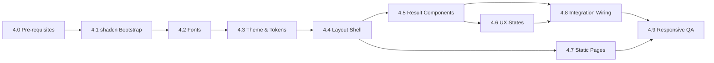

# Phase 4: UI — Design-First Execution Plan

> **Design-First Process.** This is a temporary staging document for Phase 4 UI/UX execution details. Authority and execution source-of-truth for Phase 4 is [phase-4-ui.md](phase-4-ui.md). All implementation is downstream from approved design artifacts. The single visual source of truth is [design.html](../design/design.html). No UI/UX code may be implemented or merged without prior design review and approval.

> **Canonicality Note.** This file is temporary and non-authoritative. [phase-4-ui.md](phase-4-ui.md) is the canonical Phase 4 execution and gating source-of-truth. Nothing in this staging file overrides [phase-4-ui.md](phase-4-ui.md).
> If any statement in this file conflicts with [phase-4-ui.md](phase-4-ui.md), [phase-4-ui.md](phase-4-ui.md) prevails.

> **Step 1 Scope (Truth Alignment).** Step 1 is documentation-only and does not modify runtime, app, test, or config code.


## Overview

Phase 4 delivers the full UI/UX experience for the Arabic Transliteration project, strictly following a design-first process. All visual and interaction work is governed by [design.html](../design/design.html), which is the only normative visual reference. Implementation is strictly downstream from design artifacts. No code is written or merged until the corresponding design is reviewed and approved.

### Gating Criteria

**No implementation may begin until:**

- The relevant section/component/artifact is present in [design.html](../design/design.html).
- The design has been reviewed and approved by the designated reviewer(s).
- The design artifact is referenced in the implementation PR.

**No UI/UX code is merged without design review sign-off.**


## Phase 4 Checklist Board (Steps 2-5)

Step 1 (this update) is complete as docs-only truth alignment. The board below tracks execution work from Step 2 onward while preserving design-first gating.

| Step | Objective | Dependencies | Deliverables | Exit Criteria | Owner / Status | Blockers / Risks | Evidence |
| --- | --- | --- | --- | --- | --- | --- | --- |
| 2 | Lock and approve design artifacts before implementation. | Step 1 complete; [design.html](../design/design.html) and design annotations updated; reviewer availability. | Approved design snapshots for all in-scope Stage 4 components and states; recorded design review sign-off. | Every in-scope component/state has approved design evidence and PRs can reference it. | Owner: user<br>Status: `Complete for 4.5/4.6` | Stage 4.8 interaction-flow artifacts not yet reviewed | Result card sign-off: `design.html` Integrated Result Card section, 2026-05-17<br>UX states sign-off: `design.html` UX States section, 2026-07-26 |
| 3 | Implement Phase 4 UI slices in stage order under approved designs. | Step 2 approved artifacts; Stage sequencing/dependencies in this file. | Landed UI implementation PRs for Stages 4.1-4.8 with linked approved artifacts. | All stage deliverables are implemented with no gate violations and with traceable artifact links. | Owner: user<br>Status: `Complete pending PR merge` | Stage 4.8a audio wiring, and B5/B6/B7 data-pipeline cleanup, are implemented and verified on open PRs [#16](https://github.com/themanfromnepal/arabic-transliteration/pull/16) and [#17](https://github.com/themanfromnepal/arabic-transliteration/pull/17) — neither is merged into `chore/phase-4` yet | Stages 4.0-4.7 implemented; see Stage 4.5/4.6 Delivery Record (2026-07-26) below. Stage 4.8a (audio) and data-pipeline cleanup: see Stage 4.8a / Data-Pipeline / Lighthouse Delivery Record (2026-09-12) below |
| 4 | Validate quality, accessibility, responsive behavior, and integration. | Step 3 merged implementation; QA plans from Stages 4.6-4.9. | Test and QA evidence for component behavior, a11y checks, and responsive pass criteria. | QA evidence demonstrates all Stage 4 exit conditions are met or formally waived. | Owner: user<br>Status: `Substantially complete pending PR merge` | Lighthouse budget evidence (AC3) is implemented on open PR [#18](https://github.com/themanfromnepal/arabic-transliteration/pull/18), not yet merged; LCP is asserted `warn` rather than `error` pending a performance investigation (see that PR) | a11y/tablet QA: Stage 4.9 Delivery Record (2026-07-26) below. Lighthouse: Stage 4.8a / Data-Pipeline / Lighthouse Delivery Record (2026-09-12) below |
| 5 | Prepare final Phase 4 handoff and readiness sign-off. | Step 4 validated evidence; open-risk review complete. | Phase 4 completion summary, remaining risks/blockers log, and handoff decision record. | Explicit go/no-go decision recorded with accountable owners for any carry-over risks. | Owner: user<br>Status: `Go, conditional on merging PRs #16-#18` | Carry-over risks recorded in the Step 5 section below, each with an owner | Step 5 — Phase 4 Completion Summary and Handoff Decision (2026-09-12), below |


## Stage Summary (Design-First)

| #   | Stage                   | Key Design Output                                               | Depends on |
| --- | ----------------------- | --------------------------------------------------------------- | ---------- |
| 4.0 | Pre-requisites & Dependencies | Font files confirmed, npm dependencies installed, design.html tablet breakpoint added | — |
| 4.1 | shadcn Bootstrap        | shadcn/ui primitives referenced in design.html                  | —          |
| 4.2 | Fonts                   | Font usage, fallback, and rendering defined in design.html      | 4.1        |
| 4.3 | Theme & Tokens          | Color tokens, dark mode, font-size controls in design.html      | 4.2        |
| 4.4 | Layout Shell            | Header, SearchBox, Footer, layout structure in design.html      | 4.3        |
| 4.5 | Result Components       | WordCard, RootDisplay, AudioPlayer, VerseList in design.html    | 4.4        |
| 4.6 | UX States               | Empty, loading, no-results, error, offline-ready in design.html | 4.5        |
| 4.7 | Static Pages            | About, Credits, Privacy Policy in design.html                   | 4.4        |
| 4.8 | Integration Wiring      | Interaction flows mapped in design.html                         | 4.5, 4.6   |
| 4.9 | Responsive QA           | Responsive/adaptive states, accessibility in design.html        | 4.8, 4.7   |


## Stage Details & Process


### 4.0 — Pre-requisites & Dependencies

**Must be verified complete before Stage 4.1 begins.**

**Font files (confirm all present in `/public/fonts`):**
- Amiri: Regular, Bold, BoldItalic, Italic ✓
- Scheherazade New: Regular, Medium, SemiBold, Bold ✓
- Inter: `Inter-VariableFont_opsz,wght.ttf` and `Inter-Italic-VariableFont_opsz,wght.ttf` ✓

**npm dependencies to add before starting UI work:**

| Package | Scope | Purpose |
| --- | --- | --- |
| `lucide-react` | `dependencies` | Icon library — shadcn/ui companion |
| `@testing-library/react` | `devDependencies` | Component-level unit testing |
| `@testing-library/user-event` | `devDependencies` | Simulates real user interactions in tests |
| `@axe-core/playwright` | `devDependencies` | Accessibility audit wired into Playwright E2E suite |
| `next-pwa` | `devDependencies` | Service Worker / Workbox integration for Next.js |
| `@testing-library/jest-dom` | `devDependencies` | Custom DOM matchers for Vitest component tests (`.toBeInTheDocument()`, etc.) |

**Design artifact:**
- `design.html` must include the 1024px tablet breakpoint and the full Lucide icon inventory before implementation begins.

**shadcn/ui initialization:**
- `components.json` is present at the project root. ✓
- `components/ui/` directory exists (currently empty — shadcn components not yet scaffolded). ✓

---


### 4.1 — shadcn Bootstrap

**Design Output:**
- All shadcn/ui primitives to be used are visually referenced in [design.html](../design/design.html) and listed in the component inventory.

**Process:**
- Designers add/annotate all primitives in design.html.
- Design review/approval is required before any code is written.
- Developers implement only after design artifact is approved and referenced.

**Icon Library Decision:**

| Decision | Value |
| --- | --- |
| Library | `lucide-react` (shadcn/ui companion) |
| Version | `^0.400.0` |
| Custom SVGs | Only where no Lucide equivalent exists |

**Icon inventory:**

| Lucide icon | Usage | Size |
| --- | --- | --- |
| `Search` | SearchBox input adornment | 20 |
| `Sun` | ThemeToggle — light mode | 20 |
| `Moon` | ThemeToggle — dark mode | 20 |
| `Play` | AudioPlayer — play | 20 |
| `Pause` | AudioPlayer — pause | 20 |
| `Volume2` | AudioPlayer — audio playing indicator | 16 |
| `VolumeX` | AudioPlayer — audio error state | 16 |
| `ChevronDown` | VerseList — expand occurrences | 16 |
| `ChevronUp` | VerseList — collapse occurrences | 16 |
| `X` | Dismiss error / notification | 16 |
| `CircleAlert` | Error state indicator | 20 |
| `Loader2` | Loading state (CSS spin animation) | 20 |
| `WifiOff` | Offline-ready badge | 16 |
| `ExternalLink` | Link to external source (everyayah, corpus) | 16 |

**Icon conventions:**
- Icon-only interactive elements: `aria-label` on the `<button>`, `aria-hidden={true}` on the `<svg>`.
- Decorative icons: `aria-hidden={true}`.
- Icons are not auto-mirrored for RTL — only swap intentional directional glyphs (e.g., ChevronLeft/Right in pagination).
- FontSizeControl (S/M/L/XL) uses text labels, not icons.
- Always use **named imports**: `import { Search } from 'lucide-react'`. Never use a default or namespace import (`import * as Icons from 'lucide-react'`) — this would bundle the entire icon set (~500 KB+) and violate the ≤ 200 KB initial JS + CSS budget.

---


### 4.2 — Fonts

**Design Output:**
- Font usage, fallback, and rendering details are visually specified in [design.html](../design/design.html).
- Font pairings and fallback strategies are annotated for both Arabic and English text.

**Process:**
- Designers update design.html to show all font usage and annotate requirements.
- Design review/approval is required before implementation.

**Inter variable font strategy:**
Use `Inter-VariableFont_opsz,wght.ttf` — a single variable font file covering all weights (100–900) and optical sizes. Do not load individual static weight files. Reference it via `next/font/local`.

**`next/font` decision:**
Use `next/font/local` (Next.js built-in) for all three font families:
- Automatic `font-display: swap` for Inter (English UI copy).
- `font-display: optional` for Arabic display (Amiri / Scheherazade New) to avoid FOUT on the large Arabic headline.
- Built-in `<link rel="preload">` — no manual preload tags needed.
- Zero layout shift — fonts are loaded before the page is shown.
- No CDN requests — all fonts are self-hosted.

**Arabic font subsetting:**
- Tool: `pyftsubset` (part of the `fonttools` Python package, installed separately as a one-time build step).
- Subset both Amiri and Scheherazade New against the full Quranic glyph inventory from the build pipeline.
- Retain all diacritic glyphs; do not subset diacritics.
- Keep the original `.ttf` files as backups in `public/fonts/`. Ship only `.woff2` subsets to the browser.
- Output path: `public/fonts/<Family>/<Family>-quran-subset.woff2`.
- Run subsetting once before Stage 4.2 ships; re-run only if the glyph inventory changes.

---


### 4.3 — Theme & Tokens

**Design Output:**
- All color tokens, dark mode, and font-size controls are visually specified and annotated in [design.html](../design/design.html).

**Process:**
- Designers define and annotate all tokens and controls in design.html.
- Design review/approval is required before implementation.

**ThemeProvider:**
- Library: `next-themes`
- Wraps `app/layout.tsx`: `<ThemeProvider attribute="class" defaultTheme="system" enableSystem>`
- Dark mode = `.dark` class on `<html>`, toggled by next-themes
- localStorage key: `"theme"` (next-themes default; stored values: `"light"` | `"dark"` | `"system"`)
- Default theme: `"system"` — respects `prefers-color-scheme` on first visit
- FOUC prevention: next-themes injects a blocking script before React hydration; add `suppressHydrationWarning` to `<html>`
- System preference sync: when stored as `"system"`, theme tracks `prefers-color-scheme` changes in real time

**ThemeToggle:**
- Placement: header, top-right corner, inside the nav row
- Size: 40×40px icon button, `border-radius: 0.5rem`, transparent background, `1.5px solid border`
- Icon convention: shows the **target** mode (not current mode)
  - Currently **light** → show `Moon` icon, `aria-label="Switch to dark mode"`
  - Currently **dark** → show `Sun` icon, `aria-label="Switch to light mode"`
- Transition: `var(--transition-base)` on hover/focus
- ARIA: `aria-label` on `<button>`; `aria-hidden={true}` on icon SVG

**localStorage keys:**
- Theme preference: `"theme"` (next-themes default)
- Arabic font size: `"arabic-font-size"`

**Motion / Transitions (CSS-only — no JS animation library):**
All transitions and animations use CSS only. Framer Motion and similar JS animation libraries are excluded to preserve the ≤ 200 KB initial JS + CSS budget.

Motion tokens to define in the Tailwind theme / CSS variables:

| Token | Value | Usage |
| --- | --- | --- |
| `--transition-base` | `150ms ease-in-out` | Button hover/focus, input focus ring |
| `--transition-panel` | `250ms ease-in-out` | VerseList collapsible open/close |
| `--transition-fade` | `200ms ease-out` | UX state transitions (empty → loading → result) |

All transitions must respect `prefers-reduced-motion: reduce` — set `transition: none` inside that media query.

---


### 4.4 — Layout Shell

**Design Output:**
- The full layout structure, including Header, SearchBox, Footer, and all semantic/ARIA requirements, is visually specified in [design.html](../design/design.html).

**Process:**
- Designers update design.html with annotated layout structure and accessibility notes.
- Design review/approval is required before implementation.

**Favicon:**
Provide the following files in `public/`:
- `favicon.ico` — multi-size (16×16, 32×32).
- `favicon.svg` — vector version using `--color-primary` (#2F6F5C light / #72AB96 dark).
- `apple-touch-icon.png` — 180×180 px.
Add `<link rel="icon">` and `<link rel="apple-touch-icon">` in `app/layout.tsx`.

**Error boundary:**
Implement `app/error.tsx` (Next.js App Router error boundary). Displays a minimal "Something went wrong" message with a "Try again" button that calls `reset()`. Style matches the error UX state in Stage 4.6.

**Keyboard shortcut (desktop only):**
Pressing `/` anywhere on the page focuses the SearchBox — unless focus is already inside a text input or textarea. Implement as a `useSearchShortcut` hook. Does not apply on mobile (touch devices).

**Focus management:**
- When search results appear: keyboard focus stays in the SearchBox. Results are announced via `role="status"` / `aria-live="polite"` — screen readers read the result count without moving focus.
- When the result card renders: the WordCard is scrolled into view; the first focusable element (AudioPlayer play button) is reachable via Tab.
- When VerseList expands: focus moves to the first verse item in the list.

**Tablet breakpoint:**
The 1024px breakpoint has been added to `design.html`. Use Tailwind's `lg:` prefix (1024px) for tablet-specific layout adjustments. Tailwind's default breakpoints (`sm`: 640px, `md`: 768px, `lg`: 1024px, `xl`: 1280px) are sufficient — no custom breakpoint values needed.

**Security headers (`next.config.ts`):**
Add HTTP response headers for all routes:
- `X-Content-Type-Options: nosniff`
- `X-Frame-Options: DENY`
- `Referrer-Policy: strict-origin-when-cross-origin`
- `Permissions-Policy: camera=(), microphone=(), geolocation=()`
- Content-Security-Policy: **⚠ PENDING APPROVAL** — `media-src` directive for `everyayah.com` must be confirmed before CSP is enforced. Do not block merge on this item; track as an open action.

---


### 4.5 — Result Components

**Design Output:**
- All result components (WordCard, RootDisplay, AudioPlayer, VerseList) are visually specified and annotated in [design.html](../design/design.html), referencing [../spec.md](../spec.md#result-card-contract) for structure.

**Process:**
- Designers update design.html with all result component states and accessibility annotations.
- Design review/approval is required before implementation.

---


### 4.6 — UX States

**Design Output:**
- All canonical UX states (empty, loading, no-results, error, offline-ready) are visually specified and annotated in [design.html](../design/design.html), referencing [../ux-design.md](../ux-design.md#states).

**Process:**
- Designers update design.html with all UX states and accessibility notes.
- Design review/approval is required before implementation.

**Loading state visual form: shimmer skeleton (not a spinner):**
The loading state renders a skeleton that matches the approximate shape and layout of the WordCard:
- A wide rectangular block (Arabic headline).
- Two narrower rectangular rows (transliteration + English meaning).
- A row of pill-shaped blocks (root letters).
- A rectangular button-shaped block (AudioPlayer row).

The shimmer animation is a CSS `@keyframes` gradient sweep (left-to-right) over `--color-surface` using a lighter overlay.
The skeleton element has `role="status"` and `aria-label="Loading result…"`.
Under `prefers-reduced-motion: reduce`: replace the animation with static grey blocks (no sweep).

---


### 4.7 — Static Pages

**Design Output:**
- All static pages (About, Credits, Privacy Policy) are visually specified and annotated in [design.html](../design/design.html).

**Process:**
- Designers update design.html with all static page layouts and content structure.
- Design review/approval is required before implementation.

**Content outlines (author and confirm before implementation):**

*About page (`/about`):*
- One-sentence project purpose.
- Who it is for: three learner profiles (new convert, second-generation learner, student/researcher).
- How it works: type phonetic English → Uthmani script + scholarly transliteration + English meaning + root letters + verse occurrences + audio.
- Coverage: approximately 3,500 Quranic lemmas.
- Privacy note: no accounts, no tracking, works offline after first visit.
- Open-source: MIT license (code), data sources under their respective licenses (link to Credits).

*Credits page (`/credits`):*

| Source | Attribution | URL |
| --- | --- | --- |
| Tanzil Quran Text (Uthmani, v1.1) | Tanzil Project — CC-BY-ND 4.0 | https://tanzil.net |
| Quranic Arabic Corpus (v0.4) | Kais Dukes © 2011, custom license | https://corpus.quran.com |
| Word-by-Word Translation | Tarteel / Qul — free use, permission granted 6 May 2026 | https://qul.tarteel.ai |
| Yusuf Ali Translation | Tarteel / Qul — free use, permission granted 6 May 2026 | https://qul.tarteel.ai |
| Audio | everyayah.com — Saad Al-Ghamdi (40 kbps) *(pending formal permission)* | https://everyayah.com |
| Amiri font | Khaled Hosny — OFL | |
| Scheherazade New font | SIL International — OFL | |
| Inter font | Rasmus Andersson — OFL | |
| Fuse.js | MIT | |
| Next.js, React, Tailwind CSS, shadcn/ui, Lucide React, idb-keyval | respective open-source licenses | |

*Privacy Policy page (`/privacy`):*
- **Stored locally on your device:** theme preference and Arabic font size (localStorage); lemma lookup cache (IndexedDB). Never transmitted anywhere.
- **Not collected:** no analytics cookies, no IP logging, no advertising data, no cross-site tracking.
- **Third-party connections:** everyayah.com CDN is contacted only when you press Play. No other third-party requests. All fonts, scripts, and data are self-hosted.
- **Data deletion:** clear browser site data to remove all stored data.
- **Effective date** placeholder — to be confirmed before launch.

---


### 4.8 — Integration Wiring

**Design Output:**
- All interaction flows and state transitions are mapped and annotated in [design.html](../design/design.html).

**Process:**
- Designers update design.html with all interaction flows and state diagrams.
- Design review/approval is required before implementation.

**Service Worker (app-shell precache):**
- Scope: precache `/_next/static/**`, `/fonts/**`, `/data/manifest.json`, and the root HTML shell.
- Tool: Workbox via `next-pwa` package, or hand-rolled `workbox-webpack-plugin` with `injectManifest` mode.
- Cache strategy: Cache-first for all app-shell assets (immutable hashed JS/CSS and self-hosted fonts). The Service Worker does NOT cache `/data/*.json` shards — those continue to be fetched lazily by the DictionaryStore and cached in IndexedDB via idb-keyval, as defined in architecture.md.
- Register the Service Worker in production builds only (`process.env.NODE_ENV === 'production'`).
- The Service Worker does not cache or intercept audio streaming from everyayah.com (third-party origin).
- Test: load the site, disable network in DevTools, reload — the app shell must load from cache.

**PWA manifest (`public/manifest.json`):**
```json
{
  "name": "Arabic Transliteration",
  "short_name": "ArabicTranslit",
  "description": "Phonetic Arabic search for Quranic vocabulary.",
  "start_url": "/",
  "display": "standalone",
  "background_color": "#F7F3EA",
  "theme_color": "#2F6F5C",
  "icons": [
    { "src": "/icons/icon-192.png", "sizes": "192x192", "type": "image/png" },
    { "src": "/icons/icon-512.png", "sizes": "512x512", "type": "image/png" }
  ]
}
```
Add `<link rel="manifest" href="/manifest.json">` in `app/layout.tsx`.
Icon files needed: `public/icons/icon-192.png` and `public/icons/icon-512.png`.

**SEO metadata (add to `app/layout.tsx` metadata export):**
- `title`: "Arabic Transliteration — Quranic Phonetic Search"
- `description`: "Type phonetic English to find any Quranic word in Uthmani script, with meaning, root letters, verse occurrences, and audio pronunciation."
- OpenGraph: `og:title`, `og:description`, `og:type: "website"`, `og:url`, `og:image` (1200×630 static social card).
- Twitter: `twitter:card: "summary_large_image"`, `twitter:title`, `twitter:description`, `twitter:image`.
- `robots.txt` (`public/robots.txt`): Allow all crawlers; include `Sitemap:` directive pointing to `/sitemap.xml`.
- `sitemap.xml` (`public/sitemap.xml` or generated via `next-sitemap`): List `/`, `/about`, `/credits`, `/privacy`.

**⚠ Pending: CORS/CSP for everyayah.com audio**
The `media-src` CSP directive for everyayah.com is pending approval. Do not merge a restrictive CSP until this is confirmed. Track as an open action item.

---


### 4.9 — Responsive QA

**Design Output:**
- Responsive/adaptive states, accessibility requirements, and QA checklists are visually specified and annotated in [design.html](../design/design.html).

**Process:**
- Designers update design.html with all responsive/adaptive states and accessibility notes.
- Design review/approval is required before implementation.

**Component tests (Vitest + Testing Library):**
Every UI component built in Stages 4.4–4.7 must have at minimum:
- A render smoke test (component renders without throwing).
- A behavior test for each interactive element: search input change, ThemeToggle, FontSizeControl, AudioPlayer play/pause, VerseList expand/collapse, error state dismiss.
- Tests use `@testing-library/react` and `@testing-library/user-event`.
- Create `tests/setup.ts` with `import '@testing-library/jest-dom'` and reference it in `vitest.config.mts` via the `setupFiles` option.
- Place component tests under `tests/components/`.

**axe-core accessibility audit:**
- `@axe-core/playwright` is wired into the Playwright E2E suite.
- Run `checkA11y(page)` on every key page (home, about, credits, privacy).
- Zero WCAG AA violations is a CI gate for merge to `main`.

**Tablet breakpoint QA:**
- Add a 1024px viewport profile to the Playwright device list.
- Run the full search → result card flow at 1024px width.
- Verify layout does not break between 768px and 1024px.

**Keyboard shortcut QA:**
- E2E test: press `/` on desktop → SearchBox receives focus → type query → result card appears.
- E2E test: press `/` when focus is already inside a text field → shortcut does not fire, text is typed normally.


## Process for Updating design.html and Syncing with Code

1. **Designers** update [design.html](../design/design.html) with new or revised artifacts, referencing [phase-4-ui.md](phase-4-ui.md) for structure and principles.
2. **Design review/approval** is required for all changes. Reviewers check for:
   - Visual and interaction fidelity
   - Accessibility and responsive requirements
  - Consistency with [phase-4-ui.md](phase-4-ui.md) principles
3. **Developers** may only begin implementation after design approval. All implementation PRs must reference the approved design artifact and include a design review sign-off.
4. **If design.html changes after implementation begins:**
   - Pause implementation
   - Review diffs with both designers and developers
   - Sync code to match the updated design before merging

## Additional Design Deliverables

- **Component Inventory:**
  - A complete, up-to-date inventory of all UI components, with visual references and states, must be maintained in [design.html](../design/design.html).
- **Style Guide:**
  - Color palette, typography, spacing, iconography, and interaction patterns must be documented and visually referenced in [design.html](../design/design.html).
- **Accessibility Checklist:**
  - All accessibility requirements (keyboard navigation, ARIA, color contrast, screen reader support, etc.) must be documented and visually annotated in [design.html](../design/design.html).
- **Contribution Guide:**
  - A clear process for proposing, reviewing, and updating design artifacts must be documented in this file and referenced in [design.html](../design/design.html).

## References

- [design.html](../design/design.html) — Single visual source of truth for all UI/UX work
- [phase-4-ui.md](phase-4-ui.md) — Canonical Phase 4 execution and gating source-of-truth
- [../spec.md](../spec.md) — Functional specification and result card contract
- [../ux-design.md](../ux-design.md) — UX states and visual style
- [../architecture.md](../architecture.md) — Module boundaries and bundle budgets
- [../performance.md](../performance.md) — Core Web Vitals targets and CI budgets
- [../testing-strategy.md](../testing-strategy.md) — Test pyramid and CI gates
- [../adr/0001-tech-stack.md](../adr/0001-tech-stack.md) — Stack choices (Next.js, shadcn/ui, Tailwind)

## Resolved Design Decisions

The following decisions have been confirmed and are binding for all implementation work in Phase 4.

| Decision | Resolution |
| --- | --- |
| Icon library | Lucide React (`lucide-react ^0.400.0`) |
| Motion / animations | CSS-only transitions and animations; no JS animation library |
| Inter font loading | `next/font/local` with variable font (`Inter-VariableFont_opsz,wght.ttf`) |
| Arabic font loading | `next/font/local` with `font-display: optional`; WOFF2 subsets via `pyftsubset` |
| Service Worker | Workbox (via `next-pwa` or `injectManifest`); app-shell precache; register in production only |
| Keyboard shortcut | `/` key focuses SearchBox on desktop; no shortcut on mobile |
| Loading state form | Shimmer skeleton matching WordCard shape (not a spinner) |
| Tablet breakpoint | 1024px (`lg:` in Tailwind); documented in `design.html` |
| SEO/meta | OpenGraph + Twitter cards + `sitemap.xml` + `robots.txt` + basic PWA `manifest.json` — all in Phase 4 |
| Component tests | Vitest + `@testing-library/react` + `@testing-library/user-event` in `tests/components/` |
| Accessibility CI gate | `@axe-core/playwright` — zero WCAG AA violations blocks merge to `main` |
| CORS/CSP for everyayah.com | **Pending approval** — do not enforce CSP `media-src` until confirmed |
| Theme library | `next-themes` |
| Dark mode mechanism | `.dark` class on `<html>`, toggled by `next-themes` ThemeProvider |
| localStorage key (theme) | `"theme"` (next-themes default) |
| Default theme | `"system"` (follows `prefers-color-scheme`) |
| ThemeToggle icon convention | Shows target mode — Moon when in light mode; Sun when in dark mode |
| localStorage key (Arabic font size) | `"arabic-font-size"` |


## Notes for Designers and Developers

- **Designers:**
  - All visual and interaction work must be present and annotated in [design.html](../design/design.html) before implementation begins.
  - Reference [phase-4-ui.md](phase-4-ui.md) for execution structure, principles, and gating alignment.
- **Developers:**
  - Implementation is strictly downstream from approved design artifacts.
  - No UI/UX code is merged without design review sign-off.
  - If design.html changes, implementation must pause and sync to the new design before proceeding.

---

## Dependency Graph


```mermaid
flowchart LR
    S0[4.0 Pre-requisites]
    S1[4.1 shadcn Bootstrap]
    S2[4.2 Fonts]
    S3[4.3 Theme & Tokens]
    S4[4.4 Layout Shell]
    S5[4.5 Result Components]
    S6[4.6 UX States]
    S7[4.7 Static Pages]
    S8[4.8 Integration Wiring]
    S9[4.9 Responsive QA]

    S0 --> S1 --> S2 --> S3 --> S4
    S4 --> S5 --> S6
    S4 --> S7
    S5 --> S8
    S6 --> S8
    S8 --> S9
    S7 --> S9
```


## Risks and Sequencing Notes

| Risk                                                        | Mitigation                                                                             |
| ----------------------------------------------------------- | -------------------------------------------------------------------------------------- |
| Arabic font rendering differences across operating systems  | Self-host with explicit `font-feature-settings`; test Chrome, Firefox, Safari early.   |
| shadcn dark-mode token gaps                                 | Extend the Tailwind theme in Stage 4.3 to cover missing surfaces before building UI.   |
| Mobile keyboard covering the search field                   | Test with real device viewports in 4.9; reserve scroll space below the input.          |
| Font subsetting removes needed glyphs                       | Subset against the full Quranic glyph inventory; keep the un-subsetted file as backup. |
| Integration wiring reveals engine/lookup regressions        | Run the Phase 2–3 test suites before starting 4.8; fix upstream before wiring.         |
| Static page content accuracy (credits, licensing)           | Cross-check against `data/sources/licenses.json` and [../licensing.md](../licensing.md). |
| Service Worker app-shell cache is stale after a Next.js deploy | Use `NEXT_PUBLIC_BUILD_ID` or Workbox revision hashing to invalidate the SW cache on every production deploy |
| PWA manifest icons missing at launch | Create `public/icons/icon-192.png` and `icon-512.png` before Stage 4.8 ships; add to pre-launch checklist |
| everyayah.com CORS/CSP blocks audio in production | Track as open action; do not enforce restrictive CSP until `media-src everyayah.com` is confirmed |
| Lucide React version updates change icon shapes | Pin `lucide-react` to a minor range (`^0.400.0`) and review icon changes in the upgrade changelog before bumping |
| pyftsubset removes needed Quranic glyphs during Arabic font subsetting | Validate subsetted font against full Quranic glyph inventory from the build pipeline before shipping |
| Inter variable font optical sizing causes unexpected weight rendering | Test at `opsz` 14 (body) and 32 (display) sizes; fall back to `Inter_18pt` static files if variable font behaves unexpectedly |


**Sequencing notes:**

- All implementation is downstream from design.html and requires design review/approval.
- Stages 4.5/4.6 and 4.7 are independent once 4.4 is complete and can be worked in parallel, but only after design artifacts are approved.
- Stage 4.8 must wait for both 4.5 and 4.6 because it wires result components to all UX states.
- Stage 4.9 is the only stage that requires a fully assembled application; it runs last.
- Each stage should end with a passing `tsc --noEmit`, `eslint`, and `vitest` run before moving to the next.

## Related documents

- [phase-4-ui.md](phase-4-ui.md) — Phase 4 overview and acceptance criteria
- [../spec.md](../spec.md) — Functional specification and result card contract
- [../ux-design.md](../ux-design.md) — Visual style, component inventory, and UX states
- [../architecture.md](../architecture.md) — Module boundaries and bundle budgets
- [../performance.md](../performance.md) — Core Web Vitals targets and CI budgets
- [../testing-strategy.md](../testing-strategy.md) — Test pyramid and CI gates
- [../adr/0001-tech-stack.md](../adr/0001-tech-stack.md) — Stack choices (Next.js, shadcn/ui, Tailwind)

## Verifier Remediation: Phase Analysis (2026-07-05)

### Step RAG table

| Step | RAG | Canonical acceptance criteria impact | Direct evidence | Rationale |
| --- | --- | --- | --- | --- |
| 2 — Lock and approve design artifacts | Amber | AC1, AC2 are at risk until design approval evidence is complete (`docs/phases/phase-4-ui.md:49-52`). | Design artifact content exists (`docs/design/design.html:104`, `docs/design/design.html:1220-1247`), but checklist approval evidence remains `TBD` (`docs/phases/phase-4-ui-stages.md:33-36`). | Artifact coverage is present, but explicit review sign-off evidence is incomplete. |
| 3 — Implement Phase 4 UI slices | Amber | AC1 is only partially evidenced (`docs/phases/phase-4-ui.md:49`). | Result-card components are implemented (`components/result-card/integrated-result-card.tsx:26-33`), but the home shell explicitly states live execution is out of scope (`app/page.tsx:32-41`). | Structural implementation exists, but full contract-level behavior is not yet demonstrated end-to-end. |
| 4 — Validate quality, a11y, responsive behavior | Red | AC2 and AC3 are not sufficiently evidenced (`docs/phases/phase-4-ui.md:50-53`). | Playwright is currently desktop-only (`playwright.config.ts:10`); no tablet project is defined. | Validation scope does not yet match stated responsive/a11y/performance gate depth. |
| 5 — Final handoff and readiness sign-off | Red | AC1-AC3 are not signed off for release. | Step 5 still lists status `Not started` and evidence `TBD` (`docs/phases/phase-4-ui-stages.md:36`). | Final go/no-go evidence has not been assembled. |

### Stage RAG table

| Stage | RAG | Direct evidence | Notes |
| --- | --- | --- | --- |
| 4.0 — Pre-requisites & Dependencies | Green | Direct font presence check passed for all required files via `Test-Path` on 2026-07-05 (`public/fonts/Amiri/*`, `public/fonts/Scheherazade_New/*`, `public/fonts/Inter/*`). Dependency set is present (`package.json:33`, `package.json:44`, `package.json:48-50`, `package.json:58`). Tablet breakpoint exists in design artifact (`docs/design/design.html:104`, `docs/design/design.html:1119-1120`). | Re-evaluated upward based on direct asset verification, not assumption. |
| 4.1 — shadcn Bootstrap | Green | Lucide dependency is installed (`package.json:33`), and components consume Lucide icons (`components/search-box.tsx:3`). | Evidence aligns with bootstrap/design dependency intent. |
| 4.2 — Fonts | Green | Fonts are wired through `next/font/local` and fallback/display policies in layout (`app/layout.tsx:8-54`). | Runtime wiring is present and consistent with Stage 4.2 decisions. |
| 4.3 — Theme & Tokens | Green | Theme provider is wired with system default (`components/providers.tsx:5-8`), and hydration warning handling is set (`app/layout.tsx:80`). Arabic font-size persistence key exists (`hooks/useArabicFontSize.ts:13`). | Core theme/token runtime controls are implemented. |
| 4.4 — Layout Shell | Green | Header/Search/Footer shell exists (`app/page.tsx:10-72`), and route error boundary exists (`app/error.tsx:10-39`). Slash shortcut hook is integrated (`components/search-box.tsx:10`). | Required shell primitives are in place. |
| 4.5 — Result Components | Amber | WordCard/Audio/Verse composition exists (`components/result-card/integrated-result-card.tsx:26-33`). | Still fixture-backed in home route (`app/page.tsx:32-41`), so contract behavior evidence for AC1 is partial. |
| 4.6 — UX States | Amber | Error state route exists (`app/error.tsx:10-39`), and audio status region is present (`components/result-card/audio-player-shell.tsx:45-46`). | Full explicit empty/loading/no-results/offline-ready state implementation evidence is incomplete. |
| 4.7 — Static Pages | Green | Static routes exist for About/Credits/Privacy (`app/about/page.tsx`, `app/credits/page.tsx`, `app/privacy/page.tsx`). | Stage deliverable appears implemented. |
| 4.8 — Integration Wiring | Red | `next.config.ts` contains only export/static/image config (`next.config.ts:4-6`) with no PWA/workbox integration. Runtime wiring search found no service-worker registration in app/components/hooks. Manifest metadata wiring is missing in layout: metadata object has no `manifest` key (`app/layout.tsx:56-73`), and there is no `<link rel="manifest">` in rendered markup (`app/layout.tsx:75-85`). `public/manifest.json` and `public/icons/icon-192.png`/`icon-512.png` are absent. | Strengthened finding: this is a runtime/config wiring gap, not a dependency-install gap. |
| 4.9 — Responsive QA | Red | Playwright projects define only desktop Chromium (`playwright.config.ts:10`); no tablet profile is configured. | Explicit tablet QA criterion is currently unmet; responsive validation depth is insufficient for exit confidence. |

### Blocker register

| ID | Severity | Blocker | Evidence | Exit impact |
| --- | --- | --- | --- | --- |
| B1 | High | Service worker integration not wired in config/runtime | `next.config.ts:4-6`; no SW registration references in app/components/hooks; `public/manifest.json` missing | Blocks Stage 4.8 completion and offline app-shell acceptance intent |
| B2 | High | Manifest metadata wiring not present in root layout | `app/layout.tsx:56-73` (metadata fields present without `manifest`), `app/layout.tsx:75-85` (no manifest link) | Blocks Stage 4.8 PWA/installation wiring completeness |
| B3 | Medium | Tablet profile missing in Playwright project matrix | `playwright.config.ts:10` | Blocks Stage 4.9 tablet-focused responsive QA criterion |
| B4 | Medium | Acceptance criteria 3 evidence package incomplete (performance/a11y best-practice/SEO budgets) | Canonical gate requires Lighthouse budget compliance (`docs/phases/phase-4-ui.md:52-53`), but current validation evidence is not consolidated in this phase artifact | Prevents readiness sign-off confidence |

### Explicit unknowns

- Whether formal design-review sign-off artifacts exist outside this repository for Step 2 completion.
- Whether Stage 4.6 full state coverage exists in unscanned routes/components not directly referenced by current entrypoints.
- Whether Lighthouse budget evidence is being produced externally in CI and simply not linked into this phase artifact.

### Inferred risks

- Without service-worker and manifest wiring, offline/app-install expectations may be interpreted as complete while runtime behavior is not.
- Desktop-only E2E coverage increases risk of unresolved tablet breakpoint regressions between 768px and 1024px.
- Fixture-backed result rendering may mask integration defects that would appear under live query/state transitions.

### Readiness conclusion

Phase 4 is not ready for final handoff. Current status is constrained by Red outcomes in Step 4 and Step 5, plus Red stages 4.8 and 4.9. Canonical acceptance criteria AC2/AC3 (`docs/phases/phase-4-ui.md:50-53`) remain insufficiently evidenced in this artifact despite strong progress in prerequisites and core UI shell implementation.

## Stage 4.5 / 4.6 Delivery Record (2026-07-26)

Supersedes the Amber ratings for Stages 4.5 and 4.6 in the 2026-07-05 verifier tables above. That
section is retained as a historical record and is not edited.

### Design gate

Stage 4.6 required a design artifact that did not exist: `design.html` specified the loading
skeleton (section 12.4) and the inline audio error, but empty, no-results, and offline-ready had no
visual specification — only a `WifiOff` row in the icon inventory and a transition-token comment.
A `#ux-states` section was authored and approved on 2026-07-26 before any Stage 4.6 code was
written, and is summarised in [design.md](../design/design.md). Implementation therefore remains
downstream of an approved artifact.

### Stage 4.5 — Result Components: Green

The components existed but diverged from the approved design and the spec contract. Defects found
and fixed:

| Defect | Evidence of fix |
| --- | --- |
| The Arabic font was defined but applied to nothing — `--font-arabic` had no consumer, so Arabic text inherited Inter and fell through to an OS substitute | `:lang(ar)` rule in `app/globals.css`; asserted against computed style in `e2e/home.spec.ts` |
| FontSizeControl did not reach the Arabic: the hook wrote `--font-size-arabic` on `<html>` but `WordCard` hardcoded `text-3xl sm:text-4xl` | `components/result-card/word-card.tsx`; computed-size assertion in `e2e/home.spec.ts` covers the S/M/L/XL requirement in `docs/testing-strategy.md` |
| Arabic headline had no display surface | Gradient panel in `components/result-card/word-card.tsx` per the approved card demo |
| Playing state showed a spinning loader instead of a Pause control, and the label named the state rather than the action | `components/result-card/audio-player-shell.tsx`; `tests/components/audio-player-shell.test.tsx` |
| Audio error had no inline error block | Same component; the control survives the error state so retry stays one action away |
| VerseList had no long-content behavior | Height cap and own scroll, keyboard reachable; `tests/components/verse-list.test.tsx` |
| `RootDisplay` carried `aria-label` on a roleless `div`, so it was never exposed, and the spec's hyphenated form was absent | `tests/components/root-display.test.tsx` asserts the `ر-ح-م` form and that pills are hidden from the accessibility tree |
| VerseList animated with `animate-in` / `fade-in-0` from `tailwindcss-animate`, which is not a dependency, so the classes compiled to nothing | Real CSS animation `panel-fade-in` in `globals.css`, verified present in the built stylesheet |

The last two had passing tests that asserted the class strings rather than the behavior, which is
how they survived. Those assertions were replaced with behavioral ones.

### Stage 4.6 — UX States: Green

All five canonical states are implemented as alternate contents of one region:

- `components/results/results-region.tsx` — the single container, reserved height, one shared
  `role="status"` announcement channel, crossfade keyed on state change.
- `components/results/empty-state.tsx`, `no-results-state.tsx`, `search-error-state.tsx`.
- `components/result-card/result-card-skeleton.tsx` plus the `skeleton-block` shimmer in
  `globals.css`, including the flat-block fallback under `prefers-reduced-motion`.
- `components/result-card/offline-badge.tsx`, rendered by `IntegratedResultCard` only when
  `servedFromCache`.

Coverage is `tests/components/results-region.test.tsx` (15 cases) and
`tests/components/result-card-skeleton.test.tsx`. Affordances that cannot yet act — the example
chips, the suggestion, Retry and Dismiss — render as static content until Stage 4.8 supplies
handlers, rather than shipping as inert buttons; both branches are covered.

`tests/setup.ts` is now registered through `setupFiles`, satisfying the requirement earlier in this
document.

### Verification

`npm run lint`, `npm run format:check`, `npm run typecheck`, `npm test` (300 tests, up from 270),
`npm run build`, and `npx playwright test` (7 tests) all pass. The built stylesheet was inspected
directly to confirm the new rules compile, after the `tailwindcss-animate` finding showed that a
class name in source is not evidence of a rule in the output.

### Carried forward

- Stage 4.8 and Stage 4.9 remain Red; blockers B1-B4 are unchanged.
- The home route still renders a fixture, so AC1 end-to-end behavior stays partially evidenced
  until Stage 4.8 wires live query execution.
- The no-results suggestion needs a source. Fuse.js can supply the top rejected candidate, which is
  Stage 4.8 work; the component takes it as a prop today.
- The offline badge has unit coverage only. It has no runtime trigger until the IndexedDB cache path
  is wired in Stage 4.8.
- `components/ui/tooltip.tsx` still carries `animate-in` / `zoom-in-95` classes from the shadcn
  default that compile to nothing for the same reason as the VerseList finding. Cosmetic only — the
  tooltip appears and dismisses without animation — but worth cleaning up alongside Stage 4.9.

## Blocker register additions (2026-07-26)

Raised while scoping Stage 4.8. B1-B4 above are unchanged.

| ID | Severity | Blocker | Evidence | Exit impact |
| --- | --- | --- | --- | --- |
| B5 | High | `verses.json` and `yusufali.json` are monolithic, so rendering one result card fetches the entire verse and translation corpus | 967 KB gzipped for the first card (`dictionary.json` 331 KB + `verses.json` 300 KB + `yusufali.json` 336 KB); `LemmaEntry.occurrences` carries only sura/ayah/wordIndex, so snippets cannot be resolved without both shards | First-lookup latency is roughly 0.9 s on 4G and 4.8 s on Slow 4G. Splitting both shards by sura (114 files, ~13 KB each) would take the first card to about 350 KB. Data-pipeline work; the Phase 4 targets in `docs/performance.md` were revised to measurable figures on 2026-07-26 pending this fix |
| B6 | Low | Data shards are written pretty-printed | `dictionary.json` is 5.48 MB on disk for 2.49 MB of data; same ratio across shards | Roughly doubles static export and CDN storage size. Gzip hides most of it on the wire and IndexedDB stores the parsed clone, so runtime impact is minimal. One-line fix in `scripts/build-dictionary.ts` |
| B8 | **Blocking for 4.8a** | The curated dataset cannot satisfy the result card contract: three of its six fields have no source in `LemmaEntry` | `meaning` is empty for **4,199 of 4,199 lemmas (100%)**, and every lemma is `reviewStatus: 'auto'`. There is no scholarly transliteration field at all — `phoneticKeys` holds search keys such as `DaaHk@`, not a reader-facing transliteration. `root` is Buckwalter-encoded (`$Am`, `DHk`) across 28 distinct characters, and the transliterator's `CONSONANTS` map covers only the 23-character user-input subset, so it cannot produce the Arabic root letters the spec requires (`ر-ح-م`) | Live search would render cards with a blank English meaning and no root pills, failing AC1 in `docs/phases/phase-4-ui.md`. Not a UI defect and not fixable in Phase 4. Fix path exists and is mechanical: `wbw.json` carries English for all 83,665 words keyed by sura/ayah/wordIndex, which is exactly what `LemmaEntry.occurrences` holds, so `scripts/build-dictionary.ts` can derive a lemma-level gloss; the Buckwalter root map is a ~30-line table |
| B7 | Medium | `occurrences` are duplicated between `dictionary.json` and `occurrences.json` | 49,841 occurrence rows embedded in `dictionary.json` account for 2.01 MB of its 2.49 MB parsed size, while `occurrences.json` holds the same relation separately | Removing them would take the dictionary shard to 0.77 MB parsed / 92 KB gzipped. One lemma carries 2,699 occurrences while the card previews three, so the full list belongs behind the expand action rather than in the lemma record |

### Resolved while scoping

- The ≤ 7 MB IndexedDB ceiling is **not** breached. All three cached shards total 5.05 MB parsed,
  leaving roughly 2 MB of headroom. An earlier reading of 8.44 MB came from summing pretty-printed
  file sizes rather than parsed size, which is not what IndexedDB stores.
- The inline-index bundle risk is resolved by fetching `index.json` instead of importing it. Had it
  stayed a static import, wiring search would have taken initial JS from 139 KB to roughly 207 KB,
  past the ≤ 200 KB budget. Recorded in `docs/architecture.md`.

## Stage 4.8b / 4.9 Delivery Record (2026-07-26)

Stage 4.8 was split: **4.8b** is the PWA and SEO shell, which has no design-gate dependency and no
data dependency. **4.8a** — live search wiring — is blocked by B8 and is not started.

### Stage 4.8b — PWA and SEO shell: Green

Closes B1 and B2.

| Deliverable | Implementation |
| --- | --- |
| Service worker | `public/sw.js`, hand-written. `next-pwa` was removed from `devDependencies`: it does not work with `output: 'export'` in Next 15, and `docs/architecture.md` already specified a minimal worker at this path |
| Registration | `components/service-worker-registration.tsx`, production-only, deferred to the `load` event |
| Manifest | `public/manifest.json` per the Stage 4.8 spec, linked via the `manifest` metadata key; verified present in `out/index.html` |
| Icons | `public/icons/icon-192.png`, `icon-512.png`, and a 1200×630 `public/og-card.png`, generated from `public/favicon.svg` by `scripts/generate-icons.mjs` (`npm run generate-icons`) rasterising through the Chromium that Playwright already provides, so the icons cannot drift from the favicon |
| SEO metadata | Title, description, OpenGraph, and Twitter card in `app/layout.tsx`; `themeColor` moved to the `viewport` export as Next 15 requires. Verified in the built HTML |
| robots / sitemap | `app/robots.ts` and `app/sitemap.ts` with `dynamic = 'force-static'`, emitted as `/robots.txt` and `/sitemap.xml` in the export |
| Site identity | `src/lib/site.ts` centralises the URL, titles, and route list so the sitemap cannot drift from the app |

Two things to know:

- **Absolute URLs point at localhost until the domain is set.** `NEXT_PUBLIC_SITE_URL` drives
  `metadataBase`, the OpenGraph URLs, and the sitemap. The production domain is still a placeholder
  throughout the docs, so this must be set in the deployment before launch.
- **The service worker deviates from `docs/performance.md` deliberately.** That document describes
  HTML as served "cache-first from precache". Taken literally, a cached shell would outrank a newer
  deployment indefinitely. Navigations are network-first with a cache fallback, which satisfies both
  stated intents. The reasoning is recorded in the file header.
- The worker registers in production only, so the e2e suite (which runs against `next dev`) does not
  exercise it. Offline verification remains the manual DevTools check in the Stage 4.8 spec.

### Stage 4.9 — Responsive QA and accessibility: Green

Closes B3 and B4's accessibility half. The Lighthouse budget half of B4 is unchanged.

- **Tablet profile added.** `playwright.config.ts` gains a `tablet-1024` project at 1024×768. Every
  spec runs at both widths — 32 tests per run.
- **axe gate added and enforced.** `e2e/a11y.spec.ts` runs `@axe-core/playwright` with the
  `wcag2a`/`wcag2aa`/`wcag21a`/`wcag21aa` tags across all four routes, in both themes. A CI `e2e` job
  was added to `.github/workflows/ci.yml`, because the gate existed only as an installed dependency
  before: `@axe-core/playwright` was never invoked and Playwright never ran in CI at all.
- **Keyboard flow test added,** tabbing to the verse expander and operating it without a pointer.

The gate found real defects on its first run, all `color-contrast`, all serious:

| Finding | Fix |
| --- | --- |
| The three static pages used **70 hardcoded hex colours** instead of tokens | Replaced with semantic tokens throughout `app/about`, `app/credits`, `app/privacy` |
| Consequently those pages **did not respond to dark mode at all** — body text measured **1.07:1** against the dark background, effectively invisible. The light-mode axe run was clean, so this was invisible to the gate as first written | Tokens fixed it; a dark-mode axe run was added per route so the class of bug cannot recur |
| Brass accent `#a7863a` used as text measured 3.05–3.38:1 on every light surface, failing AA | Replaced with `--color-primary`. This also realigns with `design.md`, which reserves brass for highlights and edge detail rather than text |
| `--muted-foreground` `#5f746d` measured **4.44:1** on the warm surfaces, failing AA by a hair | Darkened to `#596c65` (4.97 warm-soft, 5.50 surface), a change the eye does not register |

### Verification (4.8b / 4.9)

`npm run lint`, `npm run format:check`, `npm run typecheck`, `npm test` (303 tests),
`npm run build`, and `npx playwright test` (32 tests across both viewports) all pass.

### Note on running the suites locally

`npm run build` overwrites `.next` while a Playwright-spawned `next dev` server is still running,
which corrupts that server and produces spurious e2e failures — missing CSS and broken hydration,
affecting pre-existing tests too. Run `build` before `e2e`, or stop the dev server in between. CI is
unaffected because `reuseExistingServer` is false when `CI` is set.

## Stage 4.8a / Data-Pipeline / Lighthouse Delivery Record (2026-09-12)

Closes Stage 4.8a (live search wiring's last gap), and blockers B4, B5, B6, B7. Each landed as its
own PR against `chore/phase-4` rather than one combined change, so each is independently reviewable
and bisectable. None is merged as of this record — the status below is what's implemented and
verified on each PR's branch, not yet what's true of `chore/phase-4` itself.

### Stage 4.8a — audio playback wiring: Green (PR [#16](https://github.com/themanfromnepal/arabic-transliteration/pull/16))

The 2026-08-16 commit that wired live search left one thing unwired: pressing Play did nothing —
`AudioPlayerShell` had no `onClick` and no `<audio>` element existed anywhere in the codebase. A new
`hooks/useAudioPlayback.ts` owns a real `HTMLAudioElement` and derives idle/playing/error from its
play/pause/error events; `IntegratedResultCard` is the only caller, merging the hook's live state
into the `audio` object handed to the (still purely presentational) `AudioPlayerShell`.

**Scope decision, recorded rather than silently assumed:** the card has one audio slot, resolved
from the lemma's primary (first preview) occurrence — matching the layout already approved in
`design.html`. AC4 in `phase-4-ui.md` ("play audio for *any* listed sura:ayah occurrence") is
therefore satisfied loosely, not literally. Adding a play control to every `VerseList` row would be
new UI requiring its own design-review pass under this repo's design-first gate; that stays
explicitly deferred, not dropped. The did-you-mean suggestion and the offline-cache badge trigger
also remain unwired, unchanged from the prior record.

Verification on PR #16: typecheck, lint, format, 324 tests (up from 320 — verified directly against
both branch heads; PR #16's own commit message says 326/324, which was wrong), build, 34 e2e across
both viewports (up from 32 — one new test drives real playback against a locally-generated,
decodable silent WAV routed in place of the real everyayah.com request).

### Data-pipeline cleanup — B5, B6, B7: Green (PR [#17](https://github.com/themanfromnepal/arabic-transliteration/pull/17))

All three were data-pipeline debt recorded in the blocker-register additions below the Stage 4.5/4.6
record, none blocking Phase 4 exit on their own, all logged for cleanup once 4.8a landed.

| Blocker | Before | After |
| --- | --- | --- |
| B7 — `dictionary.json` duplicated `occurrences.json` (one lemma carries 2,699 occurrence rows; the card previews 3) | `dictionary.json` embedded every lemma's full occurrence list | New `DictionaryLemmaEntry` type (distinct from the build-time `LemmaEntry` that `merge.ts`/curation still use in full) carries `occurrencesPreview` (bounded) + `occurrenceCount`; `occurrences.json` unchanged, remains the sole full-list source, still unconsumed by any runtime code |
| B5 — `verses.json`/`yusufali.json` monolithic (967 KB gzipped fetched to render 3 snippets) | Two files covering all 6,236 verses/translations | One file per sura (`public/data/verses/<sura>.json`, `public/data/yusufali/<sura>.json`); `verse-context.ts`'s `loadVerseContext(suras)` fetches only what's asked for, cached per sura, merged into shared maps across a session |
| B6 — shards shipped pretty-printed (5.48 MB on disk for 2.49 MB parsed `dictionary.json`) | `canonicalStringify` always indented | Compact output; determinism still comes from the alphabetical key sort, not whitespace |

Measured result (B6+B7 together — the shard is compact, so on-disk size and parsed size are now the
same number): `dictionary.json` 2.49 MB → **1.50 MB** (228 KB gzipped). The blocker register's
original B7 estimate of "0.77 MB parsed" assumed removing per-lemma occurrences entirely; the shipped
design keeps a bounded `occurrencesPreview` (≤ 3 entries per lemma) so the card doesn't need a second
fetch for its own contract fields, which costs more than removing occurrences outright — 1.50 MB is
the real, correct figure, not 0.77 MB. Verse/translation shards: 114 files each, 1.2-116.5 KB raw
(median ~7-8 KB), rather than one ~1.5-1.7 MB monolithic file each. Full measurement methodology and
a worked first-lookup example (the `rahman` e2e query) are in
[performance.md](../performance.md#why-the-first-lookup-target-is-connection-qualified), re-measured
against the real post-merge shape rather than guessed.

A migration hazard was found and fixed during this work, not just theorized: `public/data` is
gitignored, so a working copy that had already run `build:data` before this change kept stale
`verses.json`/`yusufali.json` sitting alongside the new per-sura directories indefinitely — nothing
in the old cleanup list knew those filenames existed anymore. `emitShards` now explicitly deletes
both legacy filenames before writing; covered by a new test (`tests/data/emit/write.test.ts`,
"migration cleanup").

`hooks/useSearch.ts` also stopped fetching the full verse context on a no-results query, an existing
waste the old unconditional call had — `loadVerseContext` is now only called once a match exists, and
only for the suras that match's preview occurrences touch.

Verification on PR #17: typecheck, lint, format, 321 tests (up from 320 — one new migration-cleanup
test), build, 32 e2e across both viewports.

### Lighthouse CI gate — AC3: Green with one open finding (PR [#18](https://github.com/themanfromnepal/arabic-transliteration/pull/18))

Closes B4. `lighthouserc.json` runs `@lhci/cli`'s `staticDistDir` collector against the real static
export (`out/`, no dev server needed), 3 runs per route across the same four pages the axe e2e suite
already covers. A new `lighthouse` job in `.github/workflows/ci.yml` runs it in CI.

Assertion severities follow the actual per-metric intent in `performance.md`, not a blanket
pass/fail — see the updated CI-gates table in `testing-strategy.md` for the authoritative list.
Accessibility (≥ 95) and CLS (≤ 0.1) block merge and are comfortably met on every route measured (a11y
1.0, CLS ≤ 0.005 in every run). The Performance category score stays informational per
`performance.md`. Total Blocking Time is `warn`-only, the closest lab proxy for INP available —
Lighthouse cannot measure real INP in a synthetic run.

**LCP is asserted `warn`, not `error`, and this is a genuine new finding, not a workaround.** Running
the gate for the first time measured the home route at roughly 4.4-4.6 s against the documented 2.5 s
target, under Lighthouse's default mobile/Slow-4G lab throttling. First Contentful Paint alone is
~3.2 s with zero Total Blocking Time, meaning the cost sits in the critical rendering path before any
JS executes, not in JS execution itself. The other three routes (About, Credits, Privacy — no search
UI) measure 1.9-2.1 s, comfortably inside budget. Diagnosing and fixing the home route's critical
path is a performance-engineering task distinct from wiring this gate; it is **not fixed by this
record** and is carried forward below as an open risk. Shipping the LCP assertion as blocking today,
before that's understood, would make the gate permanently red rather than a usable signal.

Also not implemented: the `performance.md` requirement that an LCP regression >10% relative to the
`main` branch baseline blocks merge. That needs a persisted baseline store across CI runs (an LHCI
server, or a committed baseline artifact) — meaningfully more than this gate. Carried forward below.

`@lhci/cli`'s own dependency tree carries roughly 21 known vulnerabilities (`inquirer`/`tmp`/`uuid`/
`ws`, all transitive), confirmed additional to this repo's pre-existing 4 production vulnerabilities
(`sharp`, `postcss` — present on the unmodified baseline, confirmed by auditing it directly, unrelated
to this change). All 21 are scoped to a devDependency that runs only in CI and is never shipped to a
browser; `npm audit --omit=dev` confirms the production tree is unaffected.

Verification on PR #18: typecheck, lint, format, 320 tests, build, 32 e2e, and `npm run lighthouse`
run twice locally against the real static export (once via `npx lhci` directly, once via the npm
script) — both exit 0 with the LCP warning and no error-level assertion failures.

### Updated blocker register

| ID | Status | Resolution / carry-forward |
| --- | --- | --- |
| B4 | **Closed** | Lighthouse CI gate added (PR #18); see above for which assertions are blocking vs. informational and why |
| B5 | **Closed** | Verse/translation shards split per sura (PR #17) |
| B6 | **Closed** | JSON shards compact, not pretty-printed (PR #17) |
| B7 | **Closed** | `dictionary.json` no longer embeds full occurrence lists (PR #17) |
| — | **Open** | Home route LCP (~4.4-4.6 s vs. the 2.5 s target) under Lighthouse's lab throttling — new finding from wiring PR #18; needs a performance-engineering investigation, distinct from this record. **Owner: TBD.** |
| — | **Open** | LCP-regression-vs-`main`-baseline check from `performance.md` is not implemented — needs a persisted baseline store. **Owner: TBD.** |
| — | **Open** | Did-you-mean suggestion stays unwired — `fuzzySearch` bakes its threshold into the Fuse index, with no relaxed-second-pass API to call. **Owner: TBD.** |
| — | **Open** | Offline-cache badge (`servedFromCache`) has unit coverage only; nothing in `useSearch.ts` ever sets it `true` — no runtime trigger until the IndexedDB cache-hit path is wired. **Owner: TBD.** |
| — | **Deferred by design** | Per-occurrence audio (playing any of the listed occurrences, not just the primary one) needs its own design-review pass under the design-first gate before implementation. **Owner: TBD.** |
| — | **Correctly deferred, doc cross-reference was stale** | CSP `media-src` for everyayah.com — `security.md` already defers the full CSP to Phase 5 pending a nonce/hash strategy for Next's RSC inline scripts. The "pending approval" language earlier in this file (Stage 4.4, Stage 4.8) predates that decision and reads as if it blocks Phase 4; it doesn't. Not edited elsewhere in this file to avoid restating the same fix twice — this entry is the authoritative note. |
| — | **Open, deploy-time only** | `NEXT_PUBLIC_SITE_URL` still points at `localhost`; drives `metadataBase`, OpenGraph URLs, and the sitemap (Stage 4.8b). Must be set to the production domain before launch. **Owner: TBD.** |
| `components/ui/tooltip.tsx` cosmetic cleanup | **Still open** | Carried forward unchanged from the 2026-07-26 record — dead `animate-in`/`zoom-in-95` classes from the shadcn default compile to nothing. Cosmetic only. **Owner: TBD.** |

## Step 5 — Phase 4 Completion Summary and Handoff Decision (2026-09-12)

### Summary

Every stage from 4.0 through 4.9 has a Green delivery record with command-level verification
evidence (typecheck/lint/format/test/build/e2e counts) in this file. The three canonical acceptance
criteria in `phase-4-ui.md`:

1. **Result card matches the spec contract** — met. `docs/spec.md#result-card-contract`'s six fields
   are all sourced and rendered; live search wiring (PR #16, plus the 2026-08-16 commits) replaced
   the fixture that previously stood in for AC1.
2. **RTL rules and the accessibility baseline are respected** — met. The Stage 4.9 axe gate
   (`e2e/a11y.spec.ts`) runs `wcag2a`/`wcag2aa`/`wcag21a`/`wcag21aa` across all four routes, both
   themes, both viewports, and is enforced in CI.
3. **Lighthouse Performance/Accessibility/Best Practices/SEO meet the budgets in `performance.md`
   and `testing-strategy.md`** — **partially met.** Accessibility and CLS budgets are enforced and
   passing (PR #18). The Performance category score is informational, as documented. LCP is
   currently a `warn`, not the documented `error`, because the home route does not yet meet the 2.5 s
   target under Lighthouse's lab throttling — see the open risk below.

### Decision: **Go**, conditional on:

1. Merging PRs [#16](https://github.com/themanfromnepal/arabic-transliteration/pull/16),
   [#17](https://github.com/themanfromnepal/arabic-transliteration/pull/17), and
   [#18](https://github.com/themanfromnepal/arabic-transliteration/pull/18) into `chore/phase-4`.
   None is merged as of this record.
2. Accepting the carry-over risks in the updated blocker register above as known, owned, tracked
   items rather than Phase 4 exit blockers — none of them regress an already-met acceptance
   criterion; each either extends past what Phase 4 committed to (per-occurrence audio,
   did-you-mean, offline badge) or is explicitly out of Phase 4's scope already (CSP, per
   `security.md`'s own Phase 5 deferral) or is a newly-discovered performance question that
   deserves its own investigation rather than blocking this handoff (home-route LCP).

### Accepted carry-over risks (owners still `TBD` — assign before closing this record)

See "Updated blocker register" above for the full list and rationale. In order of user impact: the
home-route LCP finding (real, user-facing, but net latency has already been cut sharply by B5/B6/B7
this session, and the fix path is diagnosis, not guesswork); the did-you-mean suggestion and offline
badge (both degrade gracefully — their absence is a missed nicety, not a broken state); the
LCP-baseline-regression mechanism and per-occurrence audio (both are scope extensions past what
Phase 4 committed to); the tooltip cosmetic cleanup and the `NEXT_PUBLIC_SITE_URL` placeholder
(deploy-time, not code-quality, blockers).

### Evidence index

- Stage 4.0-4.7: `feat(ui): deliver Phase 4 stages 4.0-4.7` (commit `93b3e46`).
- Stage 4.5/4.6: this file's 2026-07-26 Delivery Record.
- Stage 4.8b/4.9 (PWA, SEO, a11y, tablet QA): this file's Stage 4.8b/4.9 Delivery Record.
- Stage 4.8a (live search wiring): `feat(search): wire live search to the result card` (commit
  `1c4ddfc`) plus PR #16 for the audio-playback gap it left open.
- Data quality (B8, glosses/roots/transliteration): `data: derive glosses, Arabic roots, and
  scholarly transliteration` (commit `5af077e`).
- Data-pipeline cleanup (B5/B6/B7) and Lighthouse CI (B4, AC3): PRs #17 and #18, this record.
