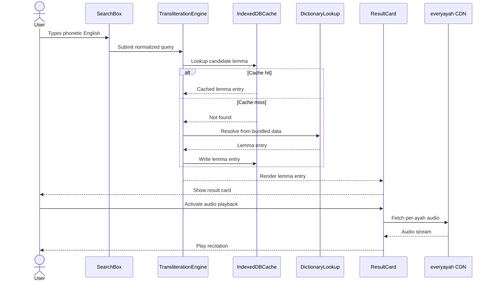

# Functional Specification (v1)

## In scope

- Phonetic English input that resolves to Quranic Arabic in Uthmani script.
- Word meaning lookup at the lemma level with English glosses.
- Root letters displayed alongside each lemma.
- Occurrences across the Quran, listed as sura:ayah references.
- Audio pronunciation streamed from everyayah.com.
- Fuzzy, typo-tolerant search powered by Fuse.js.
- Arabic input supported but not encouraged in the user interface.
- Dark mode and a reverent light mode.
- Right-to-left layout for Arabic content within a left-to-right English shell.
- Adjustable Arabic font size for readability.
- English-only user interface copy.
- Coverage of approximately 3,500 Quranic lemmas for full v1 vocabulary.
- IndexedDB cache that enables offline use after first successful load.
- Pure static site delivery with no backend or user accounts.

## Out of scope

The v1 release is intentionally narrow: phonetic transliteration, per-lemma meaning,
root letters, occurrences, and audio. No backend, no accounts, no progress tracking.

The complete catalogue of capabilities deferred beyond v1 lives in
[roadmap.md](roadmap.md#deferred-features-post-v1) and
[phases/phase-7-post-launch.md](phases/phase-7-post-launch.md). This document does
not enumerate them.

## Core user flow

A learner opens the static site and types phonetic English into the search box. The
transliteration engine normalizes the input, generates candidate Arabic forms, and queries the
IndexedDB cache for a matching lemma entry. On a cache miss, the engine falls back to the
build-time dictionary bundle shipped with the site, then writes the resolved lemma into the
IndexedDB cache for subsequent lookups. The dictionary lookup returns the lemma record used to
render the result card. When the learner activates audio playback, the result card requests the
per-ayah audio file from the everyayah.com content delivery network on demand.



## Result card contract

| Field                     | Source                              | Notes                                                                             |
| ------------------------- | ----------------------------------- | --------------------------------------------------------------------------------- |
| Arabic (Uthmani)          | Tanzil Uthmani text                 | Rendered in an Arabic display font with adjustable size and full diacritics.      |
| Scholarly transliteration | Curated lemma data                  | Uses standard diacritic conventions; intended for reference, not input.           |
| English meaning           | Quran.com word-by-word translations | Concise gloss at the lemma level; longer meanings are wrapped to multiple lines.  |
| Root letters              | Quranic Arabic Corpus               | Displayed as three or four root letters separated by a hyphen, for example ر-ح-م. |
| Audio URL                 | everyayah.com                       | Per-ayah recitation; resolved by sura:ayah and lazy-loaded on user action.        |
| Verse occurrences         | Quranic Arabic Corpus               | List of sura:ayah references with a "show all N" expansion when the list is long. |

## Input handling

### Phonetic English

The transliteration engine normalizes phonetic English before lookup. Input is lowercased,
trimmed, and stripped of punctuation. Common digraphs such as `sh`, `kh`, `th`, `dh`, and `gh` map
to the corresponding Arabic consonants. Long vowels written as doubled letters (`aa`, `ii`, `uu`)
are preserved during candidate generation.

### Arabic input

Arabic script input is supported. The engine accepts Uthmani and simple Arabic forms, normalizes
diacritics, and folds variants such as alef forms before lookup. The user interface does not
prompt for Arabic input because the primary audience is English speakers learning the script.

### Fuzzy matching

Fuse.js powers typo-tolerant search across phonetic English keys. Multiple romanization spellings
resolve to the same lemma, so `rahman`, `rahmaan`, and `raḥmān` all match the same entry. The
fuzzy matcher ranks exact prefix matches above transposition and substitution matches, and it
respects Arabizi numerals where they appear.

```text
Phonetic English -> Resolved lemma
rahman           -> الرَّحْمَٰن  (root: ر-ح-م)
rahmaan          -> الرَّحْمَٰن  (root: ر-ح-م)
ra7man           -> الرَّحْمَٰن  (root: ر-ح-م)
salaam           -> سَلَام        (root: س-ل-م)
kitab            -> كِتَاب         (root: ك-ت-ب)
qalb             -> قَلْب          (root: ق-ل-ب)
```

## Acceptance criteria for v1 launch

1. A reviewer can enter phonetic English for any of the approximately 3,500 covered Quranic
   lemmas and receive a result card containing Uthmani script, scholarly transliteration, English
   meaning, root letters, and at least one sura:ayah occurrence.
2. A reviewer can enter Arabic script for a covered lemma and receive the same result card.
3. A reviewer can introduce a single-character typo or use Arabizi numerals (7, 3, 2, 5, 9) and
   still receive the correct top result.
4. A reviewer can play audio for any listed sura:ayah occurrence and hear the recitation streamed
   from everyayah.com.
5. A reviewer can switch between light and dark mode and adjust the Arabic font size, and the
   selection persists across reloads.
6. A reviewer can use the site without a network connection after the first successful load,
   provided the lookup target was previously fetched into the IndexedDB cache. This is delivered
   by a minimal app-shell service worker that precaches HTML, JS, CSS, and fonts; full PWA
   installability is not part of v1.
7. A reviewer can navigate the entire result card flow with the keyboard alone.
8. The static site loads on a modest mobile device with the user interface in English and the
   Arabic content rendered with correct right-to-left direction.

## Audio source

Audio for each occurrence is fetched from everyayah.com using a stable per-ayah URL pattern keyed
by sura and ayah numbers, both zero-padded to three digits. The result card resolves the URL on
demand so that no audio is downloaded until the learner explicitly requests playback.

```text
https://everyayah.com/data/<reciter>/<sura>0<ayah>.mp3
example: https://everyayah.com/data/Alafasy_128kbps/001001.mp3
```

> Assumption: Default reciter is Mishary Alafasy at 128kbps
> ([https://everyayah.com](https://everyayah.com)); the reciter selection is overridable in a
> post-v1 release.
