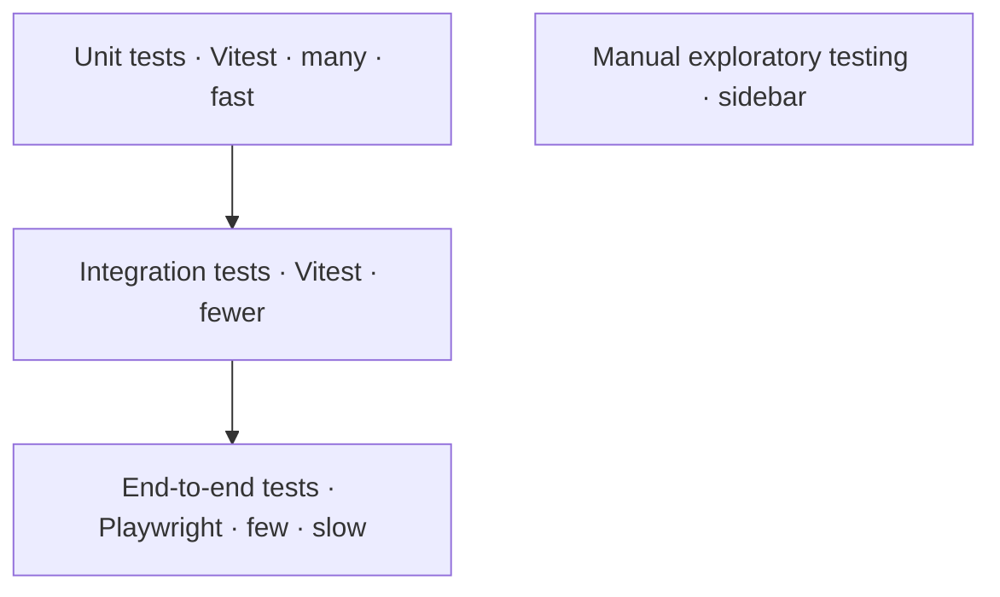

# Testing Strategy

## Goals

Testing protects the correctness of the transliteration engine, the integrity of curated lemma
data, and the experience of learners using the static site. Tests are organized as a pyramid:
many fast unit tests hold the engine and dictionary lookup to a high standard, fewer integration
tests cover the wiring between modules, and a small set of end-to-end tests proves the result
card flow in real browsers. Manual exploratory testing complements the automated suite,
especially around Arabic rendering, audio playback, and accessibility.

## Test pyramid

The manual exploratory track runs alongside the pyramid rather than within it; it is scheduled
before each launch and after major dependency updates.

## Unit tests (Vitest)

- Transliteration engine rules: per-letter mappings, digraphs (`sh`, `kh`, `th`, `dh`, `gh`),
  long vowels, Arabizi numerals (`7`, `3`, `2`, `5`, `9`), and edge cases such as leading
  articles and shadda.
- Lookup function: exact match, fuzzy match with single-character typos, multi-spelling
  resolution, and the Arabic input path.
- Cache layer: idb-keyval wrappers for read, write, and version-aware invalidation.
- Utility functions: sura:ayah formatting, root letter formatting, and phonetic key
  normalization.

Representative cases the unit suite must cover: `rahman` resolves to `الرَّحْمَٰن` with root
`ر-ح-م`; `shukran` and `shokran` both resolve to the same lemma; `7abibi` resolves to `حبيبي`;
`kitab` resolves to `كِتَاب` with root `ك-ت-ب`.

## Integration tests

- Dictionary loader resolves the lazy JSON shards described in
  [architecture.md](architecture.md#bundle-and-storage-budget) and exposes a single LemmaEntry
  surface to callers.
- Search box dispatches into the transliteration engine, which feeds the result renderer with a
  resolved lemma entry.
- IndexedDB cold path writes a shard on first use; the warm path reads it back without a network
  request.

## End-to-end tests (Playwright)

- Search flow: type phonetic English, see a result card with Uthmani script and English meaning.
- Audio playback control: play, pause, and replay an occurrence.
- Dark mode toggle persists across reload.
- Font size toggle (S, M, L, XL) applies to Arabic only.
- RTL rendering verified for the Arabic display text inside an LTR shell.
- Mobile viewport smoke test against a representative phone profile.
- Offline mode after first successful load: subsequent lookups for cached lemmas succeed with the
  network disabled.
- Keyboard navigation through the entire result card flow without a pointer.
- Screen reader landmarks: header, main, search, results, and footer are announced correctly.

## Data integrity tests

- Every LemmaEntry has all required fields populated.
- Phonetic keys are unique within a lemma.
- Root letters are exactly three characters, except for the small set of four-letter roots noted
  in [data-pipeline.md](data-pipeline.md#lemmaentry-shape).
- Every occurrence reference resolves to a real sura:ayah present in the verses shard.
- Every audio URL resolves under the everyayah.com per-ayah URL pattern.
- No orphan roots: every root listed is referenced by at least one lemma.
- No duplicate lemma identifiers across the curated dataset.

## Accessibility tests

axe-core is wired into the Playwright suite and runs against every key page on every pull
request. A keyboard-only smoke test runs in continuous integration. Manual screen reader spot
checks (NVDA on Windows and VoiceOver on macOS / iOS) are performed before launch and after any
component library change.

## Performance tests

Lighthouse CI runs on every pull request and enforces the budgets defined in
[performance.md](performance.md). Regressions on the budgeted metrics block merge.

## CI gates

| Gate           | Blocking                                | Tool                                                    |
| -------------- | --------------------------------------- | ------------------------------------------------------- |
| Lint           | Yes                                     | ESLint                                                  |
| Typecheck      | Yes                                     | `tsc --noEmit`                                          |
| Unit tests     | Yes                                     | Vitest                                                  |
| Data integrity | Yes                                     | Custom Vitest suite                                     |
| Build          | Yes                                     | Next.js build                                           |
| Lighthouse     | Informational                           | Lighthouse CI                                           |
| Playwright E2E | Yes on `main`; optional on PR for speed | Playwright                                              |
| Drift check    | Yes                                     | Re-runs `build-dictionary` script and diffs JSON shards |

Lighthouse Performance score is informational; merge gates are LCP / INP / CLS budgets and bundle
size budgets (see
[performance.md](performance.md#performance-budgets-enforced-in-ci)). The Lighthouse score is
reported as a median of 3 runs to reduce flakiness.

## Coverage targets

The transliteration engine and dictionary lookup hold a 90% or higher coverage threshold because
their correctness is load-bearing for every result card. UI components carry a lower threshold
that focuses on behavior rather than markup. Coverage is a guardrail, not a target to chase for
its own sake; meaningful assertions matter more than line counts.

## Out of scope

> Out of scope: visual regression testing in v1 and load testing of the static site, which is
> served from a CDN and has no server runtime to saturate.

## Related decisions

- [ADR-0001 Tech stack](adr/0001-tech-stack.md) — Vitest and Playwright selection.
- [ADR-0006 Hybrid build pipeline](adr/0006-hybrid-build-pipeline.md) — drift check rationale.
