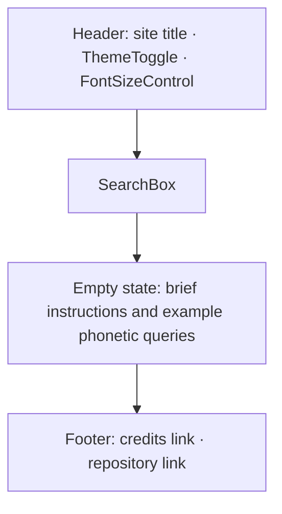
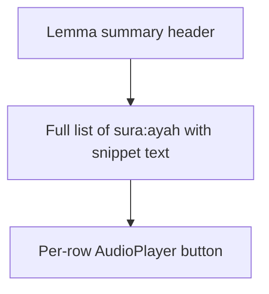

# UX Design

## Visual style

The visual language is reverent and traditional. Deep greens carry the primary surfaces and
emphasis, gold accents mark focus and interactive affordances, and subtle Islamic geometric
patterns appear sparingly as background textures or border motifs. Generous whitespace frames
content and reinforces a calm reading experience. The design avoids decorative imagery of
religious figures and avoids any decorative use of calligraphy that could be considered
disrespectful; calligraphy appears only as the Quranic text itself, rendered in the Arabic body
or display font.

- Deep greens dominate primary surfaces and emphasis.
- Gold accents are reserved for focus, links, and key affordances.
- Geometric patterns appear sparingly as background textures or border motifs only.
- Whitespace is generous; the result card is allowed to breathe.
- Restraint over ornament; no gradients and no skeuomorphism.
- No decorative imagery of religious figures and no ornamental calligraphy beyond Quranic text.

## Typography

Arabic uses Quranic-grade naskh typefaces; English uses Inter. All fonts are self-hosted from
`/public/fonts`. The Arabic font size is adjustable through a four-step scale (S, M, L, XL); the
English font size is not user-adjustable in v1.

| Use             | Family                                  | Notes                                                                    |
| --------------- | --------------------------------------- | ------------------------------------------------------------------------ |
| Arabic body     | Amiri or Scheherazade New (self-hosted) | Quranic-grade naskh; full diacritics; large default size for legibility. |
| Arabic display  | Amiri or Scheherazade New (self-hosted) | Same family at larger sizes for the result card headline.                |
| English body    | Inter (self-hosted)                     | Default UI body copy.                                                    |
| English display | Inter (self-hosted)                     | Headings and section labels.                                             |

The Arabic size scale exposes a four-step toggle (S, M, L, XL) that applies to Arabic text only.

### Font loading strategy

- Self-host all fonts from `/public/fonts`; do not load from the Google Fonts CDN. This keeps
  third-party origins out of the request graph for privacy and simplifies Content Security
  Policy.
- Subset the Arabic display font to the Quranic glyph set (~150 unique glyphs vs the full ~1500)
  to dramatically reduce file size. Subsetting is part of the build pipeline.
- Use `font-display: swap` for the English UI font (Inter) since a fallback rendering during font
  load is acceptable.
- Use `font-display: optional` (or `block` with a short timeout) for the Arabic display font,
  because fallback fonts can render diacritics in incorrect positions which is unacceptable for
  Quranic text.
- Add a `<link rel="preload" as="font" type="font/woff2" crossorigin>` for the primary Arabic
  display font so the browser fetches it as early as possible.

## Color system

Colors are referenced by token names rather than raw hex values; the canonical token table will
live alongside the Tailwind v4 theme once implemented. Token names describe role rather than
appearance, for example `surface`, `surface-elevated`, `text-primary`, `text-muted`, `accent`,
`accent-strong`, `focus-ring`, `border`, and `pattern-overlay`. Dark mode tokens are sibling
tokens defined for the same roles rather than inverted hex values, so a token always means the
same thing across themes.

## Layout

### Home / search screen



### Result card layout

```mermaid
flowchart TB
    AR[Arabic Uthmani · large display]
    TR[Scholarly transliteration]
    MN[English meaning]
    RD[RootDisplay: three or four root letters]
    AU[AudioPlayer button]
    OC[Occurrences list · first few sura:ayah · "show all N"]
    AR --> TR --> MN --> RD --> AU --> OC
```

### Occurrences expanded view



## Component inventory

| Use             | Built from                                      |
| --------------- | ----------------------------------------------- |
| SearchBox       | shadcn/ui Input plus Command palette            |
| WordCard        | shadcn/ui Card plus Separator                   |
| AudioPlayer     | shadcn/ui Button plus native HTML audio element |
| VerseList       | shadcn/ui Collapsible plus ScrollArea           |
| ThemeToggle     | shadcn/ui DropdownMenu                          |
| FontSizeControl | shadcn/ui Toggle group                          |
| Header / Footer | Custom layout composition                       |

## States

These are the canonical UX states; [spec.md](spec.md) references this list.

- Empty (initial): the screen invites a first query and shows example phonetic inputs.
- Loading (lazy JSON fetch): a non-blocking indicator while the dictionary or verses shard loads.
- No-results: a friendly message with a suggested alternate spelling.
- Error (network or audio): a dismissable inline message with a retry affordance.
- Offline-ready (cache hit indicator): a discreet badge confirming the lookup was served from the
  IndexedDB cache.

## Dark mode rules

- Respects `prefers-color-scheme` by default on first visit.
- Manual toggle persists in localStorage and overrides the system preference.
- All colors flow through tokens; no raw hex values in components.
- No images that fail in dark mode; geometric patterns adapt via theme tokens.

## RTL rules

- Arabic text is always rendered right-to-left with `dir="rtl"` and `lang="ar"`.
- The surrounding chrome remains left-to-right because the user interface copy is English.
- Inline Arabic inside English sentences uses bidirectional isolation to prevent reflow artifacts.
- Icons are not automatically mirrored when direction flips; only directional glyphs are swapped
  intentionally.

## Accessibility baseline

- WCAG 2.2 AA target across light and dark modes.
- Every interactive element is reachable and operable by keyboard.
- Focus rings are visible and use a dedicated `focus-ring` token.
- ARIA labels are provided for the audio control and the search input.
- Screen readers announce Arabic content with `lang="ar"` so the correct pronunciation profile is
  used.
- Color contrast is verified for both themes; no information is conveyed by color alone.
- Motion respects `prefers-reduced-motion`; transitions degrade to instant changes when set.

## Out of scope (UX)

> Out of scope: animations beyond minimal state transitions, illustrations, mascots, and any
> guided onboarding tour.

## Related decisions

- [ADR-0001 Tech stack](adr/0001-tech-stack.md) — selection of Next.js 15, Tailwind v4, and
  shadcn/ui underpinning the component inventory above.
